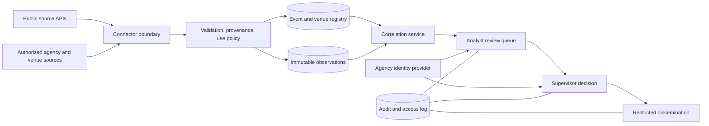

# Event Atlas — Initial Release and Reference Architecture

## Five sponsor decisions before implementation

1. **Mission and authority:** Identify the sponsoring agency, protected event classes, legal basis for each collection and share, and the accountable owner. Public-source access alone does not authorize investigative profiling.
2. **Operational scope:** Set the first jurisdictions, venue types, specific event operators, and criteria for a protected site. A nationwide list of every event location has no authoritative universal source; each included record needs an owner and verification cadence.
3. **Data agreements:** Approve source-specific licenses, terms, retention, onward sharing, and camera use. Decide whether partner, commercial, social, or government sources are necessary; none is assumed available.
4. **Human decision gates:** Approve the severity/confidence policy, analyst staffing, supervisory thresholds, emergency notification exceptions, and dissemination controls.
5. **Deployment and assurance:** Choose tenant model, identity provider, hosting boundary, accreditation process, budget, pilot jurisdictions, and go/no-go authority.

## A. Mission concept and users

The intended system maintains event and site awareness for authorized protective-security teams. Analysts inspect source-backed observations and may prepare an assessment; supervisors authorize consequential dissemination. Venue operators and cyber teams contribute their own verified asset and operational information. Executives receive bounded, time-stamped summaries. The local build in this folder is a public-data evaluation slice, not a 24/7 protective-intelligence service.

## B. System context and trust boundaries

The public-source boundary is separate from partner or government data. Tenant data, identity, cases, and exports require distinct access controls. The current server binds to `127.0.0.1`; it has local operator-token gates for analyst records and internal cases, but no agency identity provider, tenant isolation or approved case-purpose policy. It must not be exposed as an operational service.

## C. Data-source inventory and authorization matrix

| Source | Initial release | Authority and use | Freshness / gap |
|---|---|---|---|
| Wikidata Query Service venue records | Persisted snapshot, 10,096 deduplicated records retrieved 9 October 2026 | [CC0 structured data](https://www.wikidata.org/wiki/Wikidata:Licensing); community-maintained; source item URL retained; verify current status and operational fitness | Selected U.S. coordinate-bearing classes. Can include historical venues, old names, missing addresses and wrong classification. It is not a complete census. |
| NWS active alerts | Live point query for selected venue | [NWS API](https://www.weather.gov/documentation/services-web-alerts); public weather context | Five-minute cache; displayed retrieval and stale/error state. An empty response does not prove no hazard. |
| USGS earthquake feed | Recent magnitude 2.5+ observations within 250 km of selected point | [USGS GeoJSON feed](https://earthquake.usgs.gov/earthquakes/feed/v1.0/geojson.php); public observations | Five-minute cache; distance is not an impact or damage assessment. |
| CISA KEV | Latest catalog items, explicitly unlinked to venues | [CISA catalog](https://www.cisa.gov/known-exploited-vulnerabilities-catalog); public cyber watchlist | One-hour cache; venue impact needs a verified affected-product and asset link. |
| NASA EONET | Live open natural-event points near a selected place | [NASA EONET v3](https://eonet.gsfc.nasa.gov/docs/v3); public natural-event metadata | Fifteen-minute cache; a point within 250 km does not establish local impact. |
| NYC Parks calendar | Published event snapshot with place and source links | [NYC Parks dataset](https://data.cityofnewyork.us/City-Government/NYC-Parks-Public-Events-Upcoming-14-Days/w3wp-dpdi) | Rolling 14-day feed; cancellations and changes remain possible. |
| Chicago Public Library calendar | Published event snapshot with place and source links | [Chicago Public Library dataset](https://data.cityofchicago.org/Events/Chicago-Public-Library-Events/vsdy-d8k7) | Future events in the source; cancellations and changes remain possible. |
| Chicago special events | Connector tested; zero future records at the October 9, 2026 check | [Chicago special-events dataset](https://data.cityofchicago.org/Events/Special-Events/xgse-8eg7) | Does not establish absence of special events; the feed may be stale or incomplete. |
| MLB and NHL schedules | Official league schedules for the next 30 days; U.S. home-team games selected | [MLB schedule service](https://statsapi.mlb.com/api/v1/schedule), [NHL schedule service](https://api-web.nhle.com/v1/schedule/2026-10-09) | Venue name matches to Wikidata are unreviewed candidates; team participation does not verify individual attendance. |
| New York State polling sites | 5,278 site-type records from official NY GIS: NYC/non-NYC early voting and NYC/non-NYC Election Day layers | [NYS GIS polling locations](https://services6.arcgis.com/EbVsqZ18sv1kVJ3k/arcgis/rest/services/NYS_Elections_Districts_and_Polling_Locations/FeatureServer) | Source says polling sites are as of June 2026; these are location candidates, not confirmed assignments for the next election. The non-NYC early-vote layer supplied 251 records on 9 October 2026. All four New York layers succeeded at the latest full refresh; an earlier run retained all 5,278 rows marked stale after HTTP 400 responses. |
| District of Columbia voting sites | 130 site-type records: 50 Election Day vote centers, 25 early-vote centers, 55 mail-ballot drop boxes | [DC government GIS voting layers](https://maps2.dcgis.dc.gov/dcgis/rest/services/DCGIS_DATA/Government_Operations/MapServer) | Published 2026 general-election dates, hours, status, voting space and accessibility are retained when present; verify changes with DC BOE. |
| Maryland voting sites | 1,857 2026 general-election site-type records: 1,463 Election Day polling places, 102 early-vote centers and 292 mail-ballot drop boxes | [Maryland 2026 Election Day GIS](https://services.arcgis.com/njFNhDsUCentVYJW/arcgis/rest/services/2026_Maryland_General_Election_Voting_Sites_WFL1/FeatureServer/1), [Maryland early-voting PDF](https://elections.maryland.gov/elections/2026/2026_Early_Voting_Centers-GG-EN.pdf), [Maryland drop-box PDF](https://elections.maryland.gov/elections/2026/2026_General_Drop_Box_Locations.pdf) | GIS supplies source IDs, addresses, precinct fields and coordinates; source-reported 1,463 records matched imported records on 9 October 2026. The PDF addresses have no source coordinates. Sixteen drop-box rows have irregular address formatting and preserve full source text. Verify site status with the local election board. |
| Pennsylvania polling places | 9,148 May 2026 precinct rows from a statewide reference; some rows share one facility | [Pennsylvania Department of State feature layer](https://www.arcgis.com/home/item.html?id=8c98bb0313644edd9ad8c3ccdb490cff) | Estimated geocoded coordinates; no November hours or verified voter assignment. |
| North Carolina early-voting sites | 371 November 2026 sites across all 100 counties with date/hour pairs | [NCSBE polling-place data page](https://www.ncsbe.gov/results-data/polling-place-data) | November Election Day CSV not yet published; PDF has no point coordinates. |
| Connecticut early-voting sites | 174 listed sites across 169 municipalities for the November 3, 2026 State Election | [Connecticut Secretary of the State rolling location list](https://portal.ct.gov/sots/election-services/early-voting/early-voting-locations---2026) | PDF updated October 8, 2026. The state says locations are listed as available; this is not an Election Day polling-place inventory. No site-specific hours or coordinates are published in this list. |
| New Jersey early-voting sites | 171 county-provided sites across all 21 counties for the November 3, 2026 General Election | [New Jersey Division of Elections early-voting page](https://www.nj.gov/state/elections/vote-early-voting.shtml) | Statewide October 24–November 1 period and minimum weekday/weekend hours; county sections have individual update dates. Six published addresses have no ZIP. This is not an Election Day polling-place inventory. |
| Remaining U.S. jurisdictions | No imported voting-site records | [EAC state and local election office directory](https://www.eac.gov/voters/register-and-vote-in-your-state) | This directory points to jurisdictional authorities, but is not a nationwide site-level feed. Coverage is incomplete across the other states and territories. |
| Analyst event register | Local SQLite register with operator identity and separate source-review decision | HTTPS source URL, venue ID, operator token, creator/reviewer IDs and hash-linked audit entries | No agency identity provider, case-purpose authorization, independent source verification or dissemination workflow. |
| Published website DNS | Passive A/CNAME snapshot from Wikidata website hostnames | Published URL plus DNS observation time | DNS answers can be CDN, shared host or third-party infrastructure; no venue ownership inferred. |
| Caltrans, WSDOT, Maryland CHART or MD iMAP, Georgia DOT GIS, Illinois DOT, WisDOT 511, and PennDOT GIS roadway camera metadata | Public snapshots for up to ten NFL venues by distance, depending on source reachability | [Caltrans CWWP camera JSON](https://cwwp2.dot.ca.gov/documentation/cctv/cctv.htm); [WSDOT public camera GIS layer](https://data.wsdot.wa.gov/arcgis/rest/services/TravelInformation/TravelInfoCamerasWeather/FeatureServer/0); [Maryland CHART data feed](https://www.chart.maryland.gov/DataFeeds/GetDataFeeds); [Maryland iMAP CHART camera inventory](https://mdgeodata.md.gov/imap/rest/services/Transportation/MD_TrafficCameras/FeatureServer/0); [Georgia DOT camera layer](https://enterprisegis.dot.ga.gov/hosting/rest/services/web_trafficcameras/MapServer/0); [Illinois DOT Gateway layer](https://www.arcgis.com/home/item.html?id=8a885da23dfb46caaa1827ad920fb5b1); [WisDOT public 511 camera GIS layer](https://services5.arcgis.com/0pgGLzT0Nh7FVjon/ArcGIS/rest/services/511_Camera_Public/FeatureServer/0); [PennDOT public camera inventory](https://gis.penndot.gov/gis/rest/services/paprojects/paprojects/MapServer/14) | Scheduled refresh every six hours; five nearest records within 15 km of an unreviewed venue point. MD iMAP is a metadata fallback when the CHART endpoint fails; its upstream update time and camera service state are unknown. Metadata and service flags do not establish a currently working image or a venue view. Imagery is not stored, republished or analyzed. |
| Caltrans lane closures, WSDOT road alerts, Maryland CHART traffic events and closures, Illinois DOT closure/incident layer, and WisDOT 511 road events | Public snapshots within 10 km of seven venue candidate points | [Caltrans LCS JSON](https://cwwp2.dot.ca.gov/documentation/lcs/lcs.htm); [WSDOT road-alert GIS](https://data.wsdot.wa.gov/arcgis/rest/services/TravelInformation/TravelInfoRoadAlerts/FeatureServer); [Maryland CHART data feeds](https://www.chart.maryland.gov/DataFeeds/GetDataFeeds); [Illinois DOT closure/incident layer](https://services2.arcgis.com/aIrBD8yn1TDTEXoz/arcgis/rest/services/ClosureIncidents/FeatureServer); [WisDOT public 511 event point layer](https://services5.arcgis.com/0pgGLzT0Nh7FVjon/ArcGIS/rest/services/511_Event_Points_Prod_Public/FeatureServer/0) | Caltrans source reports scheduled and current closures and is documented as updating every five minutes; this site refreshes every six hours. Illinois DOT and WisDOT layer entries provide published start/end windows, but no verified effect on venue routes. WisDOT recurrence descriptions are not expanded beyond each structured record window. WSDOT and CHART entries are source-listed observations or plans without a reliable event end window in this export. Proximity does not establish travel impact or an event threat. |
| Other CCTV and transportation video | Not connected | Per-jurisdiction agreement and allowed reuse required | [Oregon TripCheck](https://tripcheck.com/Pages/API) advertises camera inventory and image URLs but registration is required; [NYC DOT documentation](https://data.cityofnewyork.us/api/views/i4gi-tjb9/files/cc7f3b15-58b7-46e3-94e7-4c5753c3a8b8?download=true&filename=metadata_trafficspeeds.pdf) directs developers to contact its Traffic Management Center for a feed. A public viewing page is not a general analytics license. |
| Social, commercial, partner, government, dark web | Not connected | Requires source-by-source lawful purpose, credentials, terms, analyst safety and collection controls | No access or approval represented. |

Every future connector must store: source ID, owner, legal/contractual authority, permitted purpose, collection and ingestion times, upstream URL or immutable reference, sensitivity, retention, access policy, reliability, coverage gap, correction route, and replay key. Batch and streaming adapters should use a versioned schema, idempotent writes, dead-letter queue, backpressure, replay and deletion/correction workflow.

## D. Data model

Core entities: `Venue` (stable source ID, names/aliases, point and later footprint, address, operator, capacity, status, provenance); `Event` (venue or area, schedule with timezone, organizer, source, attendance estimate and method, record owner, review status); `Place` (entrances, parking, transit, jurisdiction, temporary layout with effective dates); `Organization`; `Asset` (venue/vendor/system, asset owner and verification); `Observation` (exact source claim, capture and ingest times, permitted use, reliability); `Account` and `Person` (only under an authorized case); `EvidenceLink` (from, to, reason, confidence, contradictory evidence); `Assessment` (impact, severity, confidence, alternatives, reviewer); and `Decision` (action, approver, time, audience). A geographic index supports candidate lookup and routing; a point is a venue reference, never proof of a person's location. Preserve multiple identities until a reviewable resolution decision is made.

The current local JSON contains `Venue` candidates, published events, source-derived event places and 19,105 NY/DC/MD/PA/NC/WA/SC/WV/DE/FL/CT/NJ official-source voting site-type rows. The analyst register and internal case workbench share a separate local SQLite database, initially empty and inaccessible until an operator is provisioned. A voting-site record is typed as an Election Day polling place, Election Day vote center, early-vote center, general voting center, ballot drop box or secure ballot intake station; one physical site can appear in several categories. Address and coordinates are passed through from publishers when present; no current-field verification has been performed. The local case model accepts only a source-registered published event or voting site as a subject, stores its source snapshot, connector status at intake, protective purpose, responsible authority and opening rationale, then allows append-only assessment proposals with timestamped citations and independent review. No people, accounts under investigation, verified venue-owned assets or operational assessments are populated. Voting-site source failures are marked `stale_retained` or `error`; an error does not remove earlier records silently.

## E–G. Workflow, architecture and decision gates

1. **Register:** Import source records with provenance; resolve duplicates as candidate links, retaining source records and conflicts. Analyst verifies venue status and geometry before operational adoption. Event records must cite a schedule source and have an accountable owner.
2. **Ingest:** Validate schema, terms, timestamps, jurisdiction and source health. Deduplicate on source ID and content hash. Preserve original claims and corrections. Isolate untrusted text and images from instructions to models or operators.
3. **Correlate:** Match observation to event by sourced place/time/asset links. Geographic proximity only generates a review candidate. Cyber linkage requires a verified affected product in an owned asset inventory. ML may suggest extraction or clustering; deterministic policy controls access, identity linkage and dissemination.
4. **Assess:** Separate observation, allegation, capability, intent, opportunity, credibility and potential impact. Severity measures impact/urgency; confidence measures evidence quality. Satire, copies, bot amplification, stale material, and poisoned sources must be considered as alternative explanations.
5. **Review:** Low-confidence or nonspecific signals enter analyst triage without named-person conclusions. Protective notification requires a documented nexus, corroboration, analyst signoff and responsible agency. An urgent exception may notify only a defined duty officer with a later review and immutable audit. Named-person investigation additionally requires documented lawful purpose, minimization, identity-confidence review and supervisor approval.
6. **Close and learn:** Record false positives, misses, corrections and analyst overrides; measure downstream burden and reverse improper dissemination.

Proposed severity: informational context; review candidate; actionable protective concern; urgent credible threat. Proposed confidence: low (single or ambiguous source), moderate (credible source plus independent supporting evidence), high (multiple independent and directly relevant evidence lines). These are policy proposals, not measured classifier performance.

**Reference components:** API gateway; source adapters; validation and provenance store; geospatial event registry; append-only observation store; search index; evidence graph; correlation workers; analyst queue; case management; policy engine; report service; audit store; identity and key management; observability. Use a relational database with spatial extension for authoritative event/place records, object storage for source artifacts, queue for ingestion and replay, and a search index for text. A graph store is optional until evidence-link queries warrant its operational cost. Interfaces should be versioned and tenant-aware. This release uses Node's local HTTP server, public-source JSON snapshots and a local SQLite analyst/case store as an inspectable prototype.

## H. Dashboard and report fields

The implemented dashboard shows venue and voting-site record counts, category distribution, sampled national venue map, feed inventory and selected-location public context. The venue detail shows source URL, available address/capacity, passive DNS observations, NWS alerts, nearby USGS and NASA events, and unlinked KEV entries. Published-event detail shows a source-derived place, schedule, category, organizer, source URLs, official team organizations where applicable, and public conditions at the event point. It now includes a generated, read-only event situation picture with cited observations, feed state, unresolved facts and weather-alert review candidates; severity and confidence remain `not_assessed`. Voting-site search filters jurisdiction and site type; detail retains official address, date, hours, status, accessibility, source record and public conditions. The controlled analyst register captures title, venue, schedule, organizer, expected attendance if sourced, HTTPS source URL and authenticated operator identity. A distinct reviewer can accept the entry for the register or return it for correction; neither decision is a threat finding or dissemination approval.

The new Case workbench requires an operator token and an exact published-event or voting-site ID. Intake records a specific protective purpose, responsible authority, source snapshot and opening rationale. Each assessment version records analyst-entered cited claims, source observation times and classifications; analysis; protective nexus; potential impact; alternative explanations; proposed severity and separate confidence with rationale; limitations; and a proposed action. It is saved as `pending_review` with `internal_only` dissemination and `automaticNotification=false`. A different reviewer may accept it for internal review or return it for correction. Acceptance is not an operational threat designation, protective notification or approval to share. The app does not independently fetch and verify the analyst's cited URLs.

Municipal and league schedule refreshes now retain prior source records when a feed fails or unexpectedly returns zero current records. The latest refresh records additions, changed schedule/place/status fields and future listings missing from a successful feed; the latter is not labeled a cancellation. `/api/changes` and the Sources view expose the latest comparison and retained-source state. This is one comparison in the mutable local snapshot, not an immutable history or a verified source correction trail.

A production one-page event threat picture should show: event identity and source freshness; affected geography/assets; current operations; exact observations and citations; timeline; corroboration and contradictions; severity and confidence separately; alternatives; protective actions and owner; change since last report; dissemination restrictions; open questions. An investigative report is a separate restricted object, created only after the case gates above. Each assertion needs a source link, timestamp and identity-match status.

## I. Security, privacy and audit

Production controls: tenant and agency isolation, SSO/MFA, role and attribute checks, case-purpose binding, source-use labels, encryption in transit/at rest, scoped exports, tamper-evident audit, retention and correction schedules, supervisory review, anomalous-search detection, and incident response. Prohibit attendance-based bulk dossiers and inference from protected characteristics or ordinary criticism. Treat model outputs as untrusted suggestions. Test prompt injection, malicious source content and feed poisoning. Counsel and owning agencies must determine applicable constitutional, statutory, contractual and records requirements. The local build gates analyst-register and case reads and writes with random local bearer tokens, separates analyst and reviewer roles, disallows self-review, records transactional hash-linked audit entries and checks record integrity at startup and before access. Public-source browsing remains unauthenticated. These local controls do not provide agency SSO/MFA, tenant isolation, external audit anchoring, encryption, policy-enforced case purpose, backup, retention or production approval.

**Local operator setup:** `npm run operator:create -- <id> analyst <display name>` or `npm run operator:create -- <id> reviewer <display name>` prints a 256-bit token once. The operator enters it in the Event register; the browser holds it in tab memory only. `npm run operator:revoke -- <id>` disables a token and records the action. The SQLite file is under `data/private/` with directory mode `0700` and file mode `0600`. No live operator has been provisioned in this evaluation build. `/api/events` and `/api/operators/me` return `401` without a valid token. The original `data/events.json` was empty when the controlled store was introduced; a nonempty legacy file causes startup to fail pending reviewed migration. The local hash chain detects ordinary row alteration but is not an external immutable audit anchor; an administrator with full filesystem control can replace the database and its chain.

## J. Failure modes

Feed outage or slow response: serve cached data with visible stale/error status. Late or corrected records: retain original and correction lineage, revise affected assessments. Changed source terms: pause connector pending owner review. Disputed identity: preserve separate entities and suspend named-person dissemination. Model outage: deterministic rules and manual queue remain. Geographic mismatch: demand source geometry review before escalation. Event overlap or schedule change: version event and layout effective times. Map tiles unavailable: search and provenance remain accessible. This local build has no queue, backup, failover or recovery automation.

## K. Phased implementation, staffing and cost

**Phase 0:** sponsor decisions, authority matrix, pilot venues and baseline data quality. **Phase 1:** authenticated event registry, authoritative venue verification, source governance, NWS/USGS and owned operations feeds, review queue. **Phase 2:** owned cyber asset inventory, jurisdictional transportation feeds where approved, evidence links, restricted reports and audit. **Phase 3:** measured correlation and cross-agency sharing under approved agreements. Major cost drivers are data licenses, analyst coverage, source maintenance, geospatial/storage volume, case controls, security accreditation and agency integrations. Staffing should include a product owner, protective-intelligence lead, legal/privacy authority, data engineer, application/security engineers, SRE and trained analysts; actual FTE and budget depend on jurisdiction and service-level commitments.

## L. Pilot, acceptance and open decisions

Proposed technical targets for a scoped pilot: 99.9% monthly availability; public-feed ingestion under five minutes from provider publication for 95% of records; candidate alert presentation under two minutes from ingestion for 95%; p95 venue search under two seconds; report generation under 30 seconds; recovery point under 15 minutes and recovery time under four hours. None is measured or demonstrated by the current prototype. Test with synthetic or authorized historical cases for completeness, source traceability, duplicate handling, time/space correlation, adversarial content, false-positive workload, missed cases, RBAC/ABAC, export restrictions, corrections and interagency sharing. Pilot go/no-go requires agreed source coverage, a documented alert burden within analyst capacity, zero unauthorized named-person reports in test cases, complete citation traceability, successful security assessment and agency approval. Technical success does not prove real-world threat prevention.

Open decisions: initial agencies and jurisdictions; authoritative venue/event sources; acceptable record verification cadence; camera rights and format; event-system integrations; data retention; identity resolution policy; emergency exception; service levels and funded staffing. The current build is suitable for local demonstration and source evaluation only.

## Local operation and verification boundary

Run `npm start`, then open `http://127.0.0.1:4173`. Run `npm run build:venues`, `npm run sync:events`, `npm run sync:sports`, `npm run sync:voting`, and `npm run sync:dns` to regenerate snapshots; restart the server after regenerating snapshots because it loads them at process start. The voting sync uses the bundled Python runtime with `pdfplumber`; set `EVENT_ATLAS_PYTHON` to an equivalent Python if needed. Upstream availability and results may change. No API key is required for the four connected public context feeds. The browser needs network access for Leaflet, map tiles and fonts. Venue, voting-site and event records are snapshots; live conditions load only when a record is selected. No person surveillance, camera video ingestion, protective alerting, external messaging, agency access or operational validation is claimed.

## October 9, 2026 addition: event situation picture

`/api/public-event/:id` now returns a `brief` alongside the source event, place and current public conditions. The pure builder in `lib/build_event_brief.mjs` preserves exact source URLs and feed retrieval/stale state; converts a published local schedule to UTC using its named timezone; and creates an **unreviewed** analyst candidate only when a fresh NWS severe/extreme alert with immediate/expected urgency overlaps the sourced event time. A missing or ambiguous schedule, cancelled event, stale alert, or nonoverlapping alert does not create that candidate. USGS and NASA proximity remains observation context without an impact or threat inference. The builder leaves severity, confidence, analyst identity and protective action unset. Node's Temporal implementation is used for unambiguous local-time conversion; where unavailable, temporal candidate matching is disabled. This is a read-only local situation picture, not an alert queue, investigative case, authorized assessment or operational notification.

## October 9, 2026 addition: election locations

The current official election connectors import 19,105 **site-type rows** across New York, DC, Maryland, Pennsylvania, North Carolina, Washington, South Carolina, West Virginia, Delaware, Florida, Connecticut and New Jersey; this is not 19,105 unique physical facilities or nationwide coverage. NY provides 5,278 June 2026 location candidates. The latest full refresh succeeded for all four New York layers. An earlier run retained 3,655 `ny-election-day-outside-nyc` rows as stale after the publisher returned HTTP 400 for one ArcGIS query page. This demonstrates the need for explicit stale retention and last-success timestamps. DC provides 130 records with 2026 general-election dates and hours in its GIS attributes. Maryland provides 1,463 Election Day GIS records plus 394 address-only early-vote and drop-box PDF records. The importer retains source layer or PDF, source record ID, point where published, address, jurisdiction, reported status, and retrieval time, plus schedule, precinct and accessibility fields when published. The Maryland PDF parser checks its expected row counts and preserves irregular address strings without inventing a corrected address. Search and detail routes are `/api/voting-locations` and `/api/voting-location/:id`. Elections are administered locally, and [the EAC directs users to state and local election officials](https://www.eac.gov/voters/voter-faqs) for the authoritative assigned location and hours. The application must not infer a voter's assignment from proximity or an older snapshot. Add other jurisdictions only from a publisher that identifies the relevant election, source date and update process; maintain missing-jurisdiction coverage as an explicit gap.

## October 9, 2026 continuation: network and person-data gates

The municipal and league snapshots currently hold 5,379 published event records. Municipal entries link to 422 source-derived places. MLB and NHL supply 206 U.S. home-team game entries; 161 game records have a unique exact-name Wikidata venue *candidate*, not a verified venue identity. Source timezone and schedule state are retained. Official public calendars can be corrected, postponed or cancelled; the app retains source status and retrieval time and does not infer that a game or event occurred.

Passive DNS resolution checked 3,221 published website hostnames and observed 2,602 distinct public IPv4 A records. These are hostname observations, **not** venue-owned public IP inventory. Shared hosting, CDNs, vendors and publisher websites prevent ownership attribution from DNS alone. The script preserves the Wikidata website source, observed time, CNAME, and errors. It performs no port scan.

`data/scan_targets.json` is intentionally empty. `scripts/scan_authorized_targets.mjs` supports bounded web, mail, DNS and remote-access port profiles, exact single-host targets, a written authorization reference, owner, and a scan window no longer than 24 hours. It defaults to a dry run and requires `--execute` inside the window. Nmap is not installed in this workspace, and no active scan has run. A broad statement that Internet scanning is permitted does not establish which venue or third-party IPs are in scope. Scan results must be attributed to the authorized asset owner and never inferred from a venue name or public website DNS response.

`schemas/protected_person.schema.json` defines an event-specific, access-controlled record requiring a designation source, protective purpose, named event, cited professional facts, review status and retention. No person profiles are populated. Public event participants, instructors, ordinary attendees, and family members are not designated protected persons merely by appearing in a calendar or roster. The sponsoring authority must supply an authoritative designation list and approve deployment controls before person data can be stored.

## October 9, 2026 continuation: Pennsylvania polling-place reference

The Pennsylvania Department of State [May 7, 2026 feature layer](https://www.arcgis.com/home/item.html?id=8c98bb0313644edd9ad8c3ccdb490cff) contributed 9,148 rows through `scripts/sync_pennsylvania_voting.mjs`. The layer describes statewide polling-place reference points sourced from SURE and geocoded with Esri and Google services. The importer preserves the source row ID, polling-place name, address, county, precinct name and codes, accessibility claim, facility class, match status/score, and source link. Multiple precinct rows can share a physical facility. The publisher says coordinates are best-available estimates, not precise entrances or voter-assignment authority, and asks users to verify field decisions against county election records and SURE. Election-specific 2026 general-election hours and active status are not provided by this layer. The importer checks the full source ID set and rejects missing, duplicate, or implausible point rows; on failure it retains the prior rows with `stale_retained` status. Redistribution or derivative use must respect the source item’s stated geocoding-provider terms.

## October 9, 2026 continuation: North Carolina November early voting

The [North Carolina State Board of Elections polling-place data page](https://www.ncsbe.gov/results-data/polling-place-data) publishes a November 3, 2026 [early-voting site PDF](https://s3.amazonaws.com/dl.ncsbe.gov/One-Stop_Early_Voting/2026/Early_Voting_Site_List_November_2026.pdf). `scripts/sync_north_carolina_voting.py` imports 371 site rows across all 100 counties, preserving each publisher date/hour pair, address, county, and PDF page. The source supplies no point coordinates; the app does not geocode these sites. The importer checks the expected 46-page, 371-row, 100-county structure, requires matched date/hour pairs and unique source-derived IDs, and retains prior rows with a stale marker if the source changes or fails. The state board currently labels the November 2026 Election Day polling-place CSV as “coming soon”; this connector covers November early voting only.

## October 9, 2026 continuation: voting-source change tracking

The full `npm run sync:voting` pipeline now compares the completed candidate snapshot with the previous saved snapshot. `lib/voting_snapshot.mjs` records additions, changed operational fields, and records missing from a *successful* current feed in a latest-run `changeSet` with a digest, comparison timestamp, and retained-source IDs. A failed source is marked stale and does not create a false deletion. Missing from a feed is not proof that a site closed. `/api/voting-changes` exposes the latest comparison, and Sources & coverage shows it alongside event changes. The latest October 9 comparison records zero site changes and zero retained sources; inspect `/api/voting-changes` for current counts and source status. Earlier comparisons are preserved in the local voting-run archive described below.

New voting-site cases store a limited operational source snapshot at intake. Authenticated case reads compare it with the currently loaded voting snapshot and report changed fields, stale connector, missing record, or an unavailable baseline. Existing cases created before this field was added report `baseline_unavailable`. The comparison does not independently verify a site’s present field operation or grant dissemination authority. The server still loads refreshed snapshots only at startup; a running instance must restart after sync.

## October 9, 2026 continuation: Washington November voting sites

The [Washington Secretary of State statewide site page](https://www.sos.wa.gov/elections/voters/voter-registration/drop-box-and-voting-center-locations) identifies its map as the November 2026 General Election and links a [workbook](https://www.sos.wa.gov/sites/default/files/2026-01/Drop%20Boxes_0.xlsx) modified October 5, 2026. `scripts/sync_washington_voting.py` imports 655 workbook rows across all 39 counties: 594 drop boxes and 61 voting centers. It retains the publisher's name, county, address, site note, point, ZIP where present, workbook row number, source link, retrieval time and workbook modification time. The page says counties supply updates; confirm current operation with the county election office. The workbook supplies no per-site dates or hours, so those fields remain empty; the [statewide calendar](https://www.sos.wa.gov/elections/elections-calendar/dates-and-deadlines) lists the November 3 General Election and October 16 voting-period start, but that period is not asserted for every individual site. The importer validates workbook headers, state-range coordinates, distinct row IDs and all 39 counties, and retains prior rows with a stale marker if a refresh fails. No voter-assignment inference is made.

## October 9, 2026 continuation: South Carolina November early voting

The [South Carolina Election Commission 2026 statewide General Election page](https://scvotes.gov/voters/early-voting/) publishes 140 early-voting centers across all 46 counties. It says the early-voting period is October 19–31, 2026, with centers open 8:30 a.m.–6:00 p.m. Monday through Saturday and closed Sunday, October 25. `scripts/sync_south_carolina_voting.py` imports each county-listed site name and published address, preserves the county section anchor as its record URL and a source-content digest, and applies the page's election-wide schedule to these center records. The page does not provide coordinates, so the connector leaves points null and the app does not query point-based context for them. The importer checks the election and schedule text, all 46 county sections, 140 entries, ZIP presence and unique IDs; on a source/layout failure it retains prior rows as stale. These are early-voting centers, not an Election Day polling-place inventory.

## October 9, 2026 continuation: voting refresh history

`lib/voting_history.mjs` now writes a compressed, content-addressed copy of each completed voting snapshot, including the full source rows, source status and comparison set, under `data/voting_history/`. Each archive records the previous archive hash; `readVotingHistory` verifies file hashes and the chain, rejecting modified or missing files. The first archive is explicitly marked `backfilled` because it was created after its source refresh. The local chain now contains ten archives, including a Delaware parser rejection with two source errors and no Delaware rows, a completed run with 18,230 rows and 552 Delaware additions with one stale-retained New York source, an 18,760-row run with 530 Florida additions, an 18,934-row run with 174 Connecticut additions, a 19,105-row run with 171 New Jersey additions and four stale-retained New York sources, a subsequent run with one stale-retained New York source, and the latest 19,105-row run with zero changes and zero retained sources. The New York publisher intermittently returned HTTP 400 for metadata or a query range. The connector now uses longer backoff and splits failed query ranges before retaining prior records as stale. The latest refresh recovered all four layers. No site removal was inferred from the failed runs. `/api/voting-history` and Sources & coverage expose run summaries and the backfill designation. Archives are roughly 1 MB compressed at this snapshot size. They are local files, not WORM storage or an externally attested audit log; a filesystem administrator can still replace the whole archive set, and a crash between snapshot replacement and archive creation can leave a run unarchived. Deployment needs durable off-host retention, signed checkpoints and recovery/reconciliation for that gap before agency evidentiary use.

## October 9, 2026 continuation: West Virginia November early voting

The [West Virginia Secretary of State early-voting list](https://sos.wv.gov/early-voting-locations) publishes 99 sites across all 55 counties for October 21–31, 2026. Four sites open October 27. `scripts/sync_west_virginia_voting.py` preserves each published site name, address, county, Main/Satellite designation, contact phone, per-site date range, weekday hours and Saturday hours. It does not manufacture coordinates or represent these early-voting sites as Election Day polling places. The parser checks the statewide date label, table shape, ZIPs, per-row dates, 99 rows, 55 counties and unique IDs. A source/layout failure retains the prior rows marked stale. The first 99 West Virginia rows were imported directly before the next full pipeline run, so that run archived the complete 17,678-row snapshot but its latest comparison reported zero additions for West Virginia. This is a known provenance gap in the initial load, not evidence the sites predated the source import.

## October 9, 2026 continuation: Delaware November voting sites

The [Delaware Department of Elections voting locations page](https://elections.delaware.gov/elections/votinglocations.html) identifies 2026 General Election early-voting sites and links the [Kent](https://elections.delaware.gov/elections/votinglocations_kent_general.html), [New Castle](https://elections.delaware.gov/elections/votinglocations_newcastle_general.html) and [Sussex](https://elections.delaware.gov/elections/votinglocations_sussex_general.html) Election Day polling-place tables. The [general-election page](https://elections.delaware.gov/elections/general/general.html) supplies November 3, 2026 and Election Day 7 a.m.–8 p.m. hours. `scripts/sync_delaware_voting.py` imports 19 early-voting sites with the published day-specific hours and 533 distinct election-district/place mappings from 540 table lines. Seven Sussex lines are exact duplicates and are counted in source metadata rather than repeated as records. The importer checks election context, links, date and hour text, table shape, expected counts, ZIPs and unique IDs. It retains the Sussex Seaford travel advisory as a site note and does not import a location labeled primary-only. No coordinates are supplied, and no Election Day record is a voter-assignment assertion. On source or parser failure, prior Delaware rows are retained as stale.

## October 9, 2026 continuation: Florida November early voting and ballot intake

The [Florida Division of Elections 2026 General Election page](https://dos.fl.gov/elections/for-voters/voting/early-voting-and-secure-ballot-intake-stations/) links an October 2 ZIP of 67 county PDFs. `scripts/sync_florida_voting.py` imports 464 populated early-voting location entries and 66 additional secure ballot intake-station entries marked for the General Election. For early-voting sites it preserves the publisher name and facility class, exact address text, county, time zone, secure-intake indicator, and each day with a published date and hours. The PDFs contain three blank location templates that are excluded. The source omits ZIPs for 43 early-voting entries and four additional intake-station entries; the importer preserves the partial address and does not geocode it. Four location entries have no publisher name cell and are labeled by their source location number. The additional intake table supplies dates and hours for two Alachua rows in the name cell; other intake dates/hours remain unasserted.

Six early-voting records contain source date anomalies, retained in `sourceScheduleAnomalies`: one Calhoun row says 2027, four Indian River rows misspell October, and a Madison row supplies hours for five days without dates. Those day/date pairs are excluded from normalized schedules rather than silently repaired. One Lafayette site reports only five active days; this is preserved as a publisher claim, not treated as a validated statutory schedule. Each record links back to the official ZIP and records its PDF filename and page. The importer checks the election title, all 67 county PDFs, expected table and row counts, day/hour shapes, site identity, and unique source IDs. On source/layout failure it retains prior Florida rows as stale. The ZIP supplies no coordinates or Election Day polling-place list.

## October 9, 2026 continuation: Connecticut rolling early-vote sites

The [Connecticut Secretary of the State location page](https://portal.ct.gov/sots/election-services/early-voting/early-voting-locations---2026) links a five-page PDF updated October 8, 2026 for the November 3 State Election. `scripts/sync_connecticut_voting.py` imports 174 early-vote site entries covering 169 municipalities. Danbury, Mansfield, New Britain, New Haven and Windham each list two. The importer preserves municipality, published facility and address text, ZIP, PDF page, PDF URL and retrieval time. It does not infer site-specific dates, hours, Election Day status or point coordinates. The state labels the list rolling and directs users to check back as municipalities are added. The importer validates the election title, rolling notice, date, table shape, ZIPs, a minimum source size and unique derived IDs; source failure retains prior rows marked stale. These rows are location candidates for protective planning and require municipal verification before action.

## October 9, 2026 continuation: New Jersey General Election early voting

The [New Jersey Division of Elections early-voting page](https://www.nj.gov/state/elections/vote-early-voting.shtml) identifies the October 24–November 1, 2026 early-voting period for the November 3 General Election and publishes county-provided site sections. `scripts/sync_new_jersey_voting.py` imports 171 entries across all 21 counties. It preserves publisher location name, municipality label, full address text, ZIP when supplied, county-section update date, source anchor and retrieval time. Six publisher entries have no ZIP and remain incomplete rather than being geocoded. The statewide page gives Monday–Saturday 10 a.m.–8 p.m. and Sunday 10 a.m.–6 p.m. as election-wide hours; these are recorded as publisher claims, and the page says county locations are being updated. The importer checks the election period and hours, county coverage, row shape, unique IDs and a minimum count; source failure retains prior rows marked stale. These are early-vote sites, not an Election Day polling-place inventory or a verified current assignment.

## October 9, 2026 continuation: New York recovery and stale visibility

The New York ArcGIS service intermittently returned HTTP 400 for metadata and one non-NYC Election Day query range. `scripts/sync_voting_locations.mjs` now retries with longer backoff and recursively splits a failed 200-ID range down to 25-ID ranges. The full importer still compares the combined row count against the publisher object-ID count and rejects missing or malformed records. The latest full refresh imported all four New York layers successfully (5,278 rows total) and archived a zero-change, zero-retained-source comparison. The search API now supplies each row’s connector status and a filtered stale-record count; the voting list flags rows from a non-`ok` source. This exposes source freshness during publisher outages without treating retained records as current observations.

## October 9, 2026 continuation: NFL event demo

The sports importer now reads all 18 weeks of the 2026 regular season from ESPN's public NFL scoreboard and checks the 272-game season total. The current snapshot contains 263 games at 30 U.S. venues; nine international games are excluded from this U.S. venue demonstration. ESPN is a third-party schedule source, and game status, kickoff time and venue must be reconfirmed against the [NFL schedule](https://www.nfl.com/schedules/2026/by-week/reg-5) or the host club before operational use. The application retains the ESPN game ID, game URL, schedule query, teams as organizations, venue ID/name, city/state, source status and retrieval time. It does not infer that any specific player or VIP will attend.

The NFL view opens with that source selected and places future games before past games. Selecting a game shows its source-derived location, schedule, participating organizations, current NWS point alerts, nearby USGS/NASA observations and the existing unassessed situation picture. A new NWS hourly forecast connector requests the [point-linked forecast endpoint](https://www.weather.gov/documentation/services-web-api) only when the kickoff is within the approximately seven-day forecast window and a source-linked venue point exists; otherwise it explains why no forecast is available. The forecast is a time-specific weather prediction, not evidence of an event threat or actual site conditions.

Twenty-seven of the 30 ESPN venue names have a unique Wikidata name-match coordinate candidate. Three additional explicit crosswalks now map Soldier Field, EverBank Stadium and the Bills' new 2026 Highmark Stadium, making all 30 U.S. NFL venue points available as **unreviewed candidates**. The [Jaguars confirm](https://www.jaguars.com/stadiumofthefuture/faqs) EverBank Stadium remains their 2026 home while it is renovated; [Wikidata Q635117](https://www.wikidata.org/wiki/Q635117) still uses the older EverBank Field label for that same facility. The [Bills confirm](https://www.buffalobills.com/news/our-new-home-bills-unveil-logo-for-2026-inaugural-season-at-highmark-stadium) their new Highmark Stadium opened for 2026. Its [distinct Wikidata coordinate](https://www.wikidata.org/wiki/Q16251517) falls within the [OpenStreetMap new-stadium footprint](https://www.openstreetmap.org/way/1339149058), separate from the former stadium coordinate. These are source-backed venue reference points, not verified entrances, footprints or operational assets. A venue operator must verify the crosswalk and point before operational use. The Jaguars report reduced 2026 seating during renovation, so the app does not use historic capacity as an attendance estimate.

For an agency demonstration, the remaining integration gates are host-club or venue confirmation of all 30 facilities and event dates, authorized venue operations and crowd data, transportation feeds with reuse rights, communications and review workflow, and an actual agency identity and deployment boundary. The local public-source demo is not an operational law-enforcement deployment. The Nebraska election-map parser was started during the preceding voting-site expansion but not integrated into the voting pipeline; its KML contains legacy 2024 notes and is not treated as 2026 election-site evidence.

The public read-only presentation is deployed at [GitHub Pages](https://redxking.github.io/event-atlas-nfl-demo/) from the [public repository](https://github.com/redxking/event-atlas-nfl-demo). `scripts/build_public_site.mjs` exports normalized NFL games, source venue labels/candidate points, and provenance into `site/nfl.json`; the roadway-camera and road-condition connectors export bounded metadata to `site/cameras.json` and `site/roads.json`. Neither exports the local SQLite case database, operator tokens, or API routes. The Pages workflow tests, refreshes ESPN sports data, builds the static artifact, refreshes camera and road-condition metadata, and deploys on pushes to `main`, on manual dispatch, and on a six-hour cron. This is periodic refresh, not a real-time change subscription; GitHub scheduling and publisher availability can delay an update. Individual camera and road source failures are recorded in the published snapshots; the build stops only if every source in the relevant connector fails. The live page fetches NWS active alerts, NWS hourly forecast (within its forecast window) and USGS earthquake observations directly from those public APIs at selection time. On October 9, 2026, the successful Pages run served 263 games across 30 venue IDs, with 24 future games carrying ESPN's time-TBD marker; the static UI labels those kickoffs TBD rather than presenting the feed's placeholder midnight as an actual start time. An HTTP 200, matching public JSON counts, and a browser check of the first game's live conditions were observed. These checks establish the public demonstration state, not operational readiness or uninterrupted future feed availability.

The public build also snapshots the [DHS National Terrorism Advisory System consolidated XML feed](https://www.dhs.gov/ntas-api-documentation) into `site/ntas.json` on each workflow run. The parser accepts only the documented `<alerts>` structure, bounds input size, rejects DTD/entity declarations and unexpected advisory links, and retains advisory type, UTC start/end, summary, listed locations/sectors and official link for entries active at retrieval. Feed errors are published as `unavailable` and the UI suppresses a zero-entry message when the snapshot is stale or unavailable. The advisory panel is national context, separate from each game's local observations; a DHS entry is not automatically attributed to an NFL event or venue. The October 9, 2026 source retrieval returned a valid empty `<alerts>` document, so the locally generated snapshot records zero active entries at that time only. This connector does not ingest restricted law-enforcement bulletins or venue camera systems.

The public page requests its local JSON snapshots without browser caching, so a refresh can observe the latest deployed files. The public coverage panel reconciles unique NFL venue IDs against the camera and road snapshots. It displays candidate map-point, camera-inventory and road-condition counts plus a 30-venue matrix. A source counts as connected only when its venue key is in a snapshot built within 12 hours; stale, unavailable, and configured-but-failed sources remain explicit states. The panel names failed source IDs. All 30 venues have candidate points. With every configured source reachable, ten venues have camera metadata and seven have road-condition data. An earlier 9 October GitHub Pages build had HTTP 403 responses from all three Maryland CHART endpoints, reducing the deployed counts to seven and five. The camera connector now attempts Maryland's public MD iMAP CHART camera inventory when the direct camera endpoint fails. This fallback preserves location metadata and an agency viewer link, but it lacks an upstream update timestamp and current service status. The road-condition feed still has no alternate source; Maryland road coverage remains unavailable when both CHART endpoints return 403. The table treats such a failure as a failed source, never as a clean result. This is an ingestion and proximity inventory, not a measure of image availability, route impact, or the absence of hazards at unconnected venues. The [511NY developer program](https://www.511ny.org/developers/resources) requires an approved developer key for its event and camera feeds, so the Buffalo transportation gap remains open. [PennDOT's real-time RCRS feed](https://www.pa.gov/services/penndot/request-access-to-transportation-related-data-feeds) likewise requires a data-access request; the current Pennsylvania connection is camera inventory only.

## WisDOT 511 road event context for Lambeau Field

`scripts/sync_road_conditions.mjs` now queries the [WisDOT public 511 event point layer](https://services5.arcgis.com/0pgGLzT0Nh7FVjon/ArcGIS/rest/services/511_Event_Points_Prod_Public/FeatureServer/0) around Green Bay. It checks the layer edit timestamp is within 24 hours, rejects truncated responses, validates point and structured start/end fields, and includes at most 50 records within 10 km of the unreviewed Lambeau Field candidate point. The October 9, 2026 local refresh returned 256 current or future structured-window records in the query area, of which 26 were within 10 km. Each exported record preserves the road, publisher description, source record update time, structured event window, and source layer link. The UI can flag a window overlapping an illustrative game interval, but does not infer route impact or a security threat. Some description text mentions recurring work while the structured fields represent one published window; the connector does not invent later occurrences from that text. The current layer refresh and record update timestamps are distinct, and the latter can be older.

## NFL public roadway camera metadata connection

`scripts/sync_road_cameras.mjs` downloads Caltrans CWWP district 4 and 7 camera inventories, WSDOT’s public GIS camera layer for a Seattle-area bounding box, [Maryland CHART’s public camera feed](https://www.chart.maryland.gov/DataFeeds/GetDataFeeds), the [Georgia DOT public CCTV camera GIS layer](https://enterprisegis.dot.ga.gov/hosting/rest/services/web_trafficcameras/MapServer/0) for Atlanta, and [Illinois DOT Gateway’s public GIS layer](https://www.arcgis.com/home/item.html?id=8a885da23dfb46caaa1827ad920fb5b1) for the Chicago area, plus [WisDOT’s public 511 camera GIS layer](https://services5.arcgis.com/0pgGLzT0Nh7FVjon/ArcGIS/rest/services/511_Camera_Public/FeatureServer/0) for the Green Bay area and [PennDOT’s public camera inventory](https://gis.penndot.gov/gis/rest/services/paprojects/paprojects/MapServer/14) for Pittsburgh and Philadelphia after `site/nfl.json` is built. It validates inventory shape and count, maps coordinates from the sources, and writes the five closest metadata records within 15 km per covered venue to `site/cameras.json`. This covers Lumen Field, Levi’s Stadium, SoFi Stadium, M&T Bank Stadium, Northwest Stadium, Mercedes-Benz Stadium, Soldier Field, Lambeau Field, Acrisure Stadium, and Lincoln Financial Field in the current local source snapshot. The Atlanta query returned 451 camera rows on October 9, 2026; 442 active rows had valid coordinates and agency still-image links. Five closest records were exported for Mercedes-Benz Stadium. The source provides an inventory active flag but no verified image freshness or camera service state. The public page links to the source-provided still images without embedding, polling, archiving, or analyzing them. The Green Bay query returned 33 source-listed records on October 9, 2026; five were within the selected distance limit, with 511 Wisconsin viewer links. WisDOT’s enabled view flag is a publisher field, not verification of currently available video. Soldier Field’s [Wikidata coordinate](https://www.wikidata.org/wiki/Q1132413) is a point candidate tied to the [stadium’s published address](https://www.soldierfield.com/stadium-info/contact-us), still unreviewed for operations. CHART’s published operating status and cache time are displayed as source fields, not verification of live imagery; Illinois viewer links point to the state’s Gateway service. No feed is joined to a stadium’s own CCTV. A listed road camera may face away from the venue, and the venue points remain unreviewed name matches. The PennDOT layer returned 392 records in the two city query areas on October 9, 2026; five nearest per venue were exported with inventory status and record update date. Its stored thumbnail URLs and equipment fields are not exported. The viewer link opens the official 511PA camera directory, not a verified direct feed for a specific record. Failed agency sources omit their venues from the snapshot coverage map, so an outage cannot be shown as an empty camera inventory. The public UI links to agency viewers or agency still images; it does not embed or archive images or streams. Caltrans [conditions of use](https://dot.ca.gov/conditions-of-use) warn that some photographs may require additional rights. WSDOT API access codes and other jurisdictional credentials are not presumed available.

At the October 9, 2026 local refresh, the two Caltrans district files returned 756 and 592 metadata records, and the WSDOT Seattle-area query returned 476. The site retained five nearest records each for Lumen Field, Levi’s Stadium, and SoFi Stadium. This establishes source metadata and geospatial proximity only. The GitHub Pages workflow invokes `npm run sync:cameras` after building the NFL schedule. If every configured camera source fails, the job fails rather than publishing a false current camera snapshot; partial source failures appear in the generated source status.

## NFL public roadway condition connection

`scripts/sync_road_conditions.mjs` reads Caltrans LCS district 4 and 7 JSON, WSDOT public point road alerts, and Maryland CHART's public [traffic event and active road closure feeds](https://www.chart.maryland.gov/DataFeeds/GetDataFeeds). It keeps Caltrans closures whose published start is within the coming seven days and whose end has not passed. WSDOT entries and CHART incidents and closures remain source-listed observations or plans without an inferred end time. CHART's `planned` flag is retained as `sourcePlanned`, but the UI labels its closure records “closure or plan” because observed descriptions can say “Planned Closure” even when that flag is false. The export retains up to 50 nearby candidate records within 10 km of each covered California, Washington, Maryland, or Illinois venue candidate point: Lumen Field, Levi’s Stadium, SoFi Stadium, M&T Bank Stadium, Northwest Stadium, and Soldier Field. It includes source record timestamps, CHART's source field, and published Caltrans and Illinois DOT closure windows. The browser shows at most eight per selected game, ranking published windows that intersect an illustrative interval from four hours before to five hours after the published kickoff ahead of other nearby records. Matching is disabled when the snapshot is more than 12 hours old, the kickoff is TBD or past, the game is outside the source-specific timed comparison window, or the venue has no connected road feed. Caltrans's window spans seven days; the Illinois DOT published window can be compared through the listed season while the source layer edit remains within 24 hours. WSDOT and CHART records without a structured event end window cannot be time-matched. A time overlap is only a review cue: these are roadway observations and plans, not independently verified closures, event-specific disruptions, or protective threat determinations. CHART's `source` field can name a citizen, police, or other reporter and is displayed as an unverified source field, not as law-enforcement validation. The GitHub Pages workflow refreshes every six hours, which is slower than the Caltrans source publication cadence.

The same connector reads the [Illinois DOT public closure/incident ArcGIS layer](https://services2.arcgis.com/aIrBD8yn1TDTEXoz/arcgis/rest/services/ClosureIncidents/FeatureServer) for a Chicago bounding box. It rejects a missing, future, or more than 24-hour-old layer edit timestamp and exports valid published start/end windows intersecting the remaining NFL season. Soldier Field is the sixth covered venue; the October 9 source query had one record within 10 km of its unreviewed point. The page shows the layer's last edit time. A layer edit timestamp establishes that the dataset was updated, not that each individual closure remains field-verified. The record's proximity and published date overlap are review cues only; neither establishes impact on stadium access.

## NFL weather-alert review cues

The public NFL page queries the [NWS active-alert endpoint for the venue candidate point](https://www.weather.gov/documentation/services-web-alerts) when a game is selected. `site/weather_relevance.js` keeps the alert's source category, severity, urgency, effective time, hazard end (or message expiry when no end is supplied), source link, and retrieval time visible. A fresh (within five minutes) actual alert is prioritized for human review only when its published severity is Severe or Extreme, urgency is Immediate or Expected, and its time window intersects the illustrative four-hours-before to five-hours-after kickoff interval. TBD, cancelled, and elapsed games, stale data, simulated alerts, missing or invalid windows, and lower source severity or urgency do not receive the cue. The display lists at most five alerts, with time-aligned candidates first. A cue is unreviewed source context, not a threat assessment or evidence of conditions at an entrance. The point and schedule remain unverified for operations, and a negative result cannot establish the absence of a hazard. The site does not send notifications or create analyst cases.
