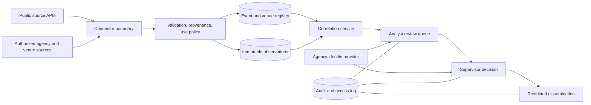

# Event Atlas — Initial Release and Reference Architecture

## Five sponsor decisions before implementation

1. **Mission and authority:** Identify the sponsoring agency, protected event classes, legal basis for each collection and share, and the accountable owner. Public-source access alone does not authorize investigative profiling.
2. **Operational scope:** Set the first jurisdictions, venue types, specific event operators, and criteria for a protected site. A nationwide list of every event location has no authoritative universal source; each included record needs an owner and verification cadence.
3. **Data agreements:** Approve source-specific licenses, terms, retention, onward sharing, and camera use. Decide whether partner, commercial, social, or government sources are necessary; none is assumed available.
4. **Human decision gates:** Approve the severity/confidence policy, analyst staffing, supervisory thresholds, emergency notification exceptions, and dissemination controls.
5. **Deployment and assurance:** Choose tenant model, identity provider, hosting boundary, accreditation process, budget, pilot jurisdictions, and go/no-go authority.

## A. Mission concept and users

The intended system maintains event and site awareness for authorized protective-security teams. Analysts inspect source-backed observations and may prepare an assessment; supervisors authorize consequential dissemination. Venue operators and cyber teams contribute their own verified asset and operational information. Executives receive bounded, time-stamped summaries. The local build in this folder is a public-data evaluation slice, not a 24/7 protective-intelligence service.

## B. System context and trust boundaries

The public-source boundary is separate from partner or government data. Tenant data, identity, cases, and exports require distinct access controls. The current server binds to `127.0.0.1`; it has local operator-token gates for analyst records and internal cases, but no agency identity provider, tenant isolation or approved case-purpose policy. It must not be exposed as an operational service.

The public Pages workflow builds a source-linked Markdown and HTML report for every upcoming U.S. NFL game. Games more than seven days away receive labeled season-planning snapshots without point-alert or event-hour forecast checks. Games within seven days, active games with a kickoff within the preceding 18 hours, and games marked complete within 24 hours of listed kickoff receive near-term monitoring reports. The ESPN source's pre/in/post status is retained so a live game does not disappear when it is no longer scheduled; delayed, postponed and cancelled states are excluded from automatic time screening until a reliable revised kickoff is published. A live game is surfaced first in the public list. The road comparison remains eligible through five hours after listed kickoff when a current agency record overlaps the event window; it does not establish route impact. After its hourly source refresh, the build checks NWS point alerts and an hourly forecast at each unreviewed venue candidate point: kickoff hour before play, current event hour while the game is in progress. These are forecasts, not observed conditions. The build joins the current published snapshots and writes a manifest that the open page checks every five minutes. A failed source check is shown as unavailable; it is never represented as a negative finding. The NOAA SPC connector retries a failed layer response and, if any Day 1–3 layer remains invalid, publishes a failed forecast snapshot with no polygon matches so other report sources can still update. The report is regenerated on a successful workflow run and remains a point-in-time, unreviewed public-source compilation. A published report page checks its per-game manifest every five minutes while visible and reloads itself only when that exact game has a newer successful publication, preserving the reader’s scroll position where browser storage permits. It reports a failed publication check and does not claim source freshness from a reload. The report also presents a bounded dated source timeline that labels publisher time, alert effective time, and this system’s first-observed change time separately; it is not an incident chronology. The browser's on-demand report can include newer direct checks. Neither report has verified VIP attendance, venue CCTV, agency operational feeds, or an assessed threat level.

The near-term report and open game view also query the [NWS observation-station link from the venue point](https://www.weather.gov/documentation/services-web-api), inspect up to three listed stations within 50 km, and accept a timestamped observation only when its station record is current within 90 minutes and the check is current within ten minutes for briefing use. The report gives station name, distance, observation time, bounded temperature, wind, humidity and description, and cites the immutable NWS record URL. This is a nearby station measurement, not weather measured inside the stadium or a prediction for kickoff. An unavailable or stale response remains a coverage gap. The local Qwen evidence packet can include a current station row as a source-linked context item; it cannot infer venue impact from the reading.

The hourly public build also checks [NASA EONET version 3 GeoJSON](https://eonet.gsfc.nasa.gov/docs/v3) for open natural events. For each EONET event it uses only the latest dated geometry; the NFL venue comparison accepts a point dated within seven days and within 250 km of the unreviewed venue point, retaining at most five nearby records. The public view, evidence bundle, and report show the NASA record, geometry date, category, distance, feed status and source limitations. A nonpoint latest geometry is omitted; the 500-event query and NASA curation are not a complete incident inventory. An open listing or a nearby point does not verify a current local incident, predict conditions at kickoff, establish venue impact, or indicate a threat. Agency or local incident sources remain necessary for operational conclusions.

The public picture and report compare the published time of a nearby preliminary EPA AirNow PM2.5 station observation with the dated NOAA HMS smoke polygons that contain the venue candidate point. They label same-window, later, different-window, absent-polygon and unavailable-source cases separately, with links to both records and the bounded nearby NIFC wildfire-point count. A newly displayed same-window relationship enters the public change trail only when both source snapshots were current on comparable checks and at least one advanced. This is a time relationship across distinct locations and data products, not source attribution, ground exposure, a health assessment, or a venue threat. It updates with each source snapshot and remains marked unreviewed.

The near-term report also checks the [USGS magnitude 2.5+ weekly GeoJSON feed](https://earthquake.usgs.gov/earthquakes/feed/v1.0/geojson.php). Up to three valid event points within 250 km of the candidate venue point retain source ID and link, magnitude, occurrence and publisher update times, and distance. A successful check time is recorded separately from an unavailable feed. The published change trail and Atom feed add a newly displayed or revised nearby record only across two successful, newer checks; disappearance from the bounded sample is not labeled resolution. These records remain regional observations, not evidence of stadium effects or a threat.

For a local NFL case brief, the server reuses a five-minute USGS fetch cache and applies the same bounded venue selector. A failed or stale USGS response enters the case bundle as unavailable. When current, up to three dated and source-linked earthquake observations can enter the Qwen evidence packet as `Q` rows. The model can prioritize these IDs for analyst verification; its selection does not establish shaking at the stadium, damage, or threat relevance.

The report now includes an analyst verification queue generated from current time-screened source cues and a bounded set of failed or stale critical sources (NFL schedule, NWS point alerts, NWS hourly forecast, and selected-game direct publisher check). Each row identifies the source observation or coverage failure, the event phase, a fixed source-specific verification action, and an HTTPS publisher link. The open game view derives the same queue from its latest loaded evidence, while the hourly report rebuilds it with each publication. It is not an automatically accepted risk score, dispatch order, task completion record, or threat finding. Season-planning reports label the queue not started; a missing cue is never an all-clear.

The scheduled reports also read the existing Indianapolis IMPD and Charlotte-Mecklenburg CMPD delayed area aggregates when those teams play at the covered home venue and the snapshots are less than 12 hours old. They retain the reporting window, publisher lag, 5 km count, source link, and the distinction from active police alerts. For a listed Gillette Stadium game, the build directly checks MBTA Foxboro station alerts and the publisher's game-date schedule. Both are independently fallible: an API error leaves that source unavailable without suppressing the rest of the report. The schedule is a service plan; the alert time screen is only a review cue. Neither establishes event access impact or a threat.

For Lambeau Field reports, the hourly build checks the [City of Green Bay's published RSS categories](https://www.greenbaywi.gov/rss.aspx) for Emergency Alerts and Police Department Alerts independently. Each check retains the source build date, retrieval state, official notice link and any listed active items. The city RSS build date observed on October 10, 2026 was about one hour after retrieval, so the report flags a possible publisher clock or timezone error and uses the successful retrieval time for snapshot freshness. Both checked categories listed zero items in that local run. Their citywide website lists have no incident geometry and are not a complete emergency alert, CAD, stadium, or protective-intelligence feed. An empty list is not an all-clear; a future listed item requires analyst verification of its scope and event relevance. New or changed notices enter the public change trail only across two newer, complete category checks.
When current, up to two official Green Bay website notices can enter the local Qwen public evidence packet as `B` rows. The model can select those IDs for a fixed city-verification question; it receives neither private case material nor an inferred venue threat from the city feed.
The hourly Lambeau connector also checks the [Packers' game-day information page](https://www.packers.com/lambeau-field/gameday-information) for six bounded published operating details: gate opening, planned Oneida and Lombardi street closures, postgame one-way flow, free game-day bus service, and the rideshare meeting point. The report calculates illustrative start times from the listed kickoff only when it is not TBD; those are planning times, not observed operations. The source page supplies no revision timestamp, so the connector records retrieval time and hashes the matched source passages. If a passage disappears, the snapshot is partial; if it changes across two complete newer checks, the change trail asks an analyst to review the venue page. A current general home-game plan does not verify that traffic controls or buses are operating for the specific game. The city's Metro Transit developer data license limits use to rider assistance or promotion of transit, so that separate licensed data feed is not ingested into this intelligence demo.

Each scheduled build now writes a bounded comparison state alongside the report. The next build reads that state from the previously published Pages artifact, checks event identity and age, and compares only current, comparable source samples for newly displayed NWS/road/MBTA cues, publisher team headlines, kickoff forecast changes, source-status changes and schedule changes. It retains at most 30 recent change entries in the report and manifest. A missing prior state starts a new baseline; a failed source check never becomes a negative or clearance claim. The resulting trail depends on successful hourly builds and source samples, and is not a complete publisher archive or a real-time alert subscription.
The hourly build also publishes `reports/changes.json` and an Atom subscription at `reports/changes.xml`. These aggregate up to 100 recent, source-linked change entries from near-term game histories over the preceding 14 days. Each entry links to its event report and the publisher record, and is labeled unreviewed. This is a polling subscription to observed changes in bounded samples; publication can lag the source, and a missing entry is not evidence that conditions are unchanged.
The comparison also handles NOAA SPC and WPC forecast cues and SEPTA B Line alerts when both runs contain comparable current source snapshots. SEPTA notices use their publisher alert ID, title and effect for comparison; the feed's changing publication timestamp does not create a fresh notice by itself. This change in comparison identity resets the published state to a new baseline once. Philadelphia website-wide notices are compared by title and source link only when both city endpoint checks are complete. New or text-changed notices enter the bounded report change history as unreviewed city context; a missing notice is not labeled resolved. An open Eagles game view checks the newer published notice snapshot on its five-minute refresh cycle.
The NFL headline connector checks ESPN and CBS Sports RSS and ESPN’s public headline API independently on each hourly build. It retains each source URL, available publisher build time, retrieval time and failure state, and displays bounded source-linked team-mention headlines from each current source. The API provides no build timestamp, so only its retrieval time and each article publication time are claimed. A failed or stale publisher check creates a partial-coverage gap without hiding the other publisher's headlines. The published comparison state moves to v6 and starts a new baseline when the API source first appears, so pre-existing ESPN story links do not appear as fresh news solely because this connector was added. New displayed links can enter later change trails only across comparable current snapshots. Team-name matching remains discovery context; it does not establish that an article concerns the specific game or constitutes a threat. These feeds do not replace local reporting or agency alerts.
Roadway cues now use their stable connector record ID, title and event-window basis for comparison. Moving a citation from a generic agency layer to an event-specific query does not by itself create a new roadway cue. The comparison state was reset to v3 to discard one transition-time duplicate caused by that link upgrade.

The Seahawks–49ers Lumen brief also checks [Sound Transit’s exact-game event timetable](https://www.soundtransit.org/get-to-know-us/news-events/calendar/seahawks-vs-san-francisco-2026-10-11) on the hourly build. It extracts five listed Seattle arrival times, return departures relative to actual game end, and additional T Line connecting service. When both the operator page and [Seahawks game guide](https://www.seahawks.com/game-day/) are current, the report compares the operator's listed Seattle arrivals with the club's 11:30 a.m. gate plan: three scheduled before, two after. This comparison is planning context only; King Street Station is separate from stadium entry. It is not live train tracking, a crowd estimate, or verification of service. The authenticated local Qwen packet may include one bounded, source-linked `Z1` operator row for analyst verification. A changed operator timetable text enters the published change trail as a review prompt, not a cancellation claim.

Sound Transit [publishes a GTFS real-time service-alert JSON feed](https://www.soundtransit.org/help-contacts/business-information/open-transit-data-otd/otd-downloads) for Sounder N and S Line and other rail routes. The hourly Pages build now reads that official feed, checks its publisher timestamp, and retains only bounded route-selected Sounder notices with original header text, effect code, active periods and operator link. The October 10, 2026 check returned three Sounder notices, one explicitly naming the Seahawks–49ers game and classified by the publisher as `ADDITIONAL_SERVICE`; that is a service announcement, not an incident. The report shows all route-selected notices separately from the exact-game timetable; only a small set of disruption effect codes can become event-window review cues. A route notice may concern another station and does not establish venue impact. The current public site refreshes this layer hourly, not continuously, and the operator warns that last-minute changes may be absent from its alert page. New or revised notices enter the published change trail; disappearance alone is not treated as resolution. The local Qwen packet may carry at most three source-linked, event-window notices as `L` rows for analyst verification. [Sound Transit's Transit Data Terms of Use](https://www.soundtransit.org/help-contacts/business-information/open-transit-data-otd/transit-data-terms-use) apply to the displayed data and downstream recipients; the public interface links those terms and preserves operator alert text. Sounder vehicle positions and trip updates are not available from this keyless source.

For Lumen Field, the hourly build now queries the [City of Seattle Real Time Fire 911 Calls dataset](https://data.seattle.gov/Public-Safety/Seattle-Real-Time-Fire-911-Calls/kzjm-xkqj) through a server-side Socrata aggregate. It requests only `count(*)` and the latest dispatch time within a rolling two-hour Seattle-local window and a 5 km circle around the unreviewed Lumen point; it never downloads addresses, incident numbers, response types, or individual coordinates. The source metadata must show a dataset update within 30 minutes at ingestion. The October 10, 2026 06:55 UTC check returned 14 source-listed dispatches and a 06:51 UTC dataset update. The published report labels this an area count, not an active police alert, stadium incident, event impact, trend, or threat. A moving two-hour count must not be compared with an earlier window as a trend. A failed or stale source becomes an explicit gap, never a zero count. The authenticated local case path checks the same aggregate on demand with a five-minute cache. While a Lumen game is open, the public browser also requests only this city aggregate and metadata directly on selection and about every five minutes while visible; it labels the retrieval mode and check time, accepts a verified zero count, and shows a failed check as unavailable. The static public report still refreshes hourly; a downloaded browser report can include the newer direct observation. Qwen can receive only a bounded `J1` count row for analyst verification. The city's [open-data risk assessment](https://www.seattle.gov/documents/Departments/SeattleIT/DigitalEngagement/OpenData/FPF-Open-Data-Risk-Assessment-for-City-of-Seattle.pdf) identifies address, location and incident type as potentially sensitive, which is why this connector does not retain those fields.

### Falcons exact-game published plans

The hourly build checks the [official Falcons game-day page](https://www.atlantafalcons.com/tickets/gameday) for the Oct. 11 Ravens–Falcons game. It requires the exact matchup, local date, kickoff, and Mercedes-Benz Stadium identity before retaining nine bounded source-passage hashes. These cover the roof plan pending weather, parking and gate times, tailgate, four published meet-and-greet groups, and John Abraham’s announced Ring of Honor induction. Seven named people enter the event’s announced-person view with attendance unverified and protective status unassigned; the club notes appearances may change. The report and browser brief display the dated publisher plans, and the local Qwen packet may rank two source-linked rows for analyst follow-up. A failed or older-than-12-hour check is unavailable. This is neither a live venue operations feed nor a verified person-presence source.

### MARTA same-day regional rail schedule

The hourly build checks [MARTA’s special rail schedules](https://itsmarta.com/special-rail-schedules.aspx) for Sunday, October 11, 2026. It isolates the dated section and retains source-passage hashes for the Gold, Red, Blue and Green lines. Each currently lists 12-minute frequency until 6:30 p.m., 15 minutes until 9 p.m., and 20 minutes afterward. This same-day regional plan enters the Ravens–Falcons browser brief and report, with a separate local Qwen `F4` evidence row for analyst verification. The operator page does not identify a specific train run, station condition, or special service for the game; the frequency comparison is not an event impact finding. A missing line, failed retrieval or check older than 12 hours is marked partial or unavailable.

### MARTA Train Alerts preview

The hourly build also checks the [official MARTA homepage](https://itsmarta.com/) Train Alerts panel. It retains at most five unexpired preview notices with bounded operator text, retrieval time, source-passage hash, and the publisher-listed expiry converted from Atlanta local time. The [operator alert page](https://itsmarta.com/ride/alerts) is linked for confirmation. The Ravens–Falcons brief compares each expiry with an illustrative window starting four hours before kickoff; expiry after that boundary is a review candidate, not proof the notice began during the window or will remain active. A candidate may enter the local Qwen public packet as `F5`, where the model can only request operator verification. The homepage panel is a preview and can omit alerts; it has no published start time, verified venue geometry, or guarantee that the alert concerns the stadium. The October 10 check listed a Midtown elevator notice expiring before the Falcons event window, so it did not become an event-window candidate. A stale or failed check is unavailable, and an empty preview is never an all-clear.

### Georgia DOT Fulton County traffic table

The hourly build reads the public JSON table used by the [Georgia DOT incident-report page](https://incidentreport.dot.ga.gov/) and retains up to ten Fulton County rows with source event ID, road names, publisher category/status, bounded public description and publisher-displayed times. An October 10 retrieval returned 57 statewide rows and two Fulton rows; a subsequent retrieval no longer listed the recent crash row, illustrating that the table is dynamic. The site’s own JavaScript formats numeric date values with the UTC display zone, while the newest value appears roughly four hours behind actual UTC. Its intended time-zone basis is not verified; this connector preserves the displayed wall-clock text and does not convert it to UTC, infer that a row is active, or compare it with kickoff. Fulton County scope supplies no stadium distance or route effect. The Falcons brief shows the county total and any rows with publisher-displayed updates within a conservative eight-day window. A local Qwen `F6` row is available only when at least one such row is retained. These use the table as context for an analyst to verify against Georgia DOT and a geocoded road source. This public table endpoint is distinct from 511GA’s documented developer API, which requires a key. A failed or older-than-two-hour retrieval is unavailable, not a zero-incident finding.

### New Orleans preliminary public-call aggregate

The hourly build queries the [Data.NOLA 2026 Calls for Service dataset](https://data.nola.gov/Public-Safety-and-Preparedness/Calls-for-Service-2026/es9j-6y5d), which the publisher attributes to Orleans Parish Communication District and NOPD. It requests only a count of records with public coordinates within 2 km of the unreviewed Caesars Superdome point for a wall-date selected from the preceding New Orleans local calendar day. Separate count-only and maximum `timecreate` requests plus Socrata dataset metadata check source currency. No call IDs, descriptions, categories, block addresses or coordinates enter the site or case packet. An October 10 check of the October 9 publisher date returned 226 mapped calls and a dataset update at 08:01 UTC; these are provisional public records, not active calls or stadium incidents.

The dataset description says NOPD may change classifications for 36 hours, some sensitive call types have no public coordinates, locations are approximate, and records should not be compared over time. The connector therefore makes no trend, baseline, anomaly, event-risk or threat claim. The source's `timecreate` field is treated as publisher wall-clock text with unverified zone; no exact event-window comparison is made. A stale metadata update, latest publisher date preceding the count window, failed query or snapshot older than 12 hours makes the count unavailable. When current, a bounded `K5` source-status row may enter the local Qwen evidence packet; it cannot substantiate a current incident. An authorized current incident source and venue confirmation remain necessary for operational assessment.

### New Orleans RTA public service-alert preview

The hourly build reads the [New Orleans RTA service-alert page](https://www.norta.com/ride-with-us/service-alerts) for Caesars Superdome briefs. It preserves the publisher's printed `AS OF` text, route label, notice title, bounded description and source-passage hash. An October 10 retrieval listed 26 notices, of which 10 had publication dates within three calendar days; the page also retained notices months old. This is a public-page preview, not the RTA realtime vehicle feed. [RTA's open-data page](https://www.norta.com/help-and-contacts/business-information/open-transit-data-%28otd%29) says realtime feed access requires a signed agreement and key. The connector does not use that feed.

The brief counts recently dated notices and shows detailed rows only when their text names the Superdome, Poydras, Loyola or Union Passenger Terminal. A named place is a review candidate, not verified route geometry, event-window overlap, an active service disruption, or stadium impact. The RTA page provides no verified notice end times, and the printed time zone is not established; no exact kickoff comparison is made. A current page contributes a bounded `K4` source-status row to the local Qwen packet. Source-passage changes for place-name candidates enter the next published change trail. Failed or older-than-two-hour retrievals are unavailable, never an all-clear.

### Saints pregame access cross-source review

For the Oct. 11 Saints–Vikings game, the brief computes a Champions Square plan window from the listed kickoff: three hours to 45 minutes before kickoff, only while the exact-game Saints guide's matching source passage is current. It compares that interval with source-timed Louisiana DOTD 511 records from a road snapshot that passed the existing freshness and event-window checks. Only records within 10 km of the unreviewed venue point and with an intersecting published interval become two-source verification leads. Each lead cites both the [Saints guide](https://www.neworleanssaints.com/news/saints-vs-vikings-2026-nfl-week-5-gameday-guide) and the [Louisiana DOTD public road layer](https://maps.dotd.la.gov/gdw/rest/services/Road_Closures/511_Road_Closures/FeatureServer/0). The October 10 local comparison found an LA 18 roadwork record 5.2 km from the candidate point whose published 12:30–18:00 UTC window overlaps the calculated 14:00–16:15 UTC club plan. This is an analyst task to verify the current road record, route geometry and venue access plan; it does not establish that event attendees use LA 18, that roadwork is active, or that there is stadium impact or a threat. If either source is stale, the comparison is unavailable rather than a negative finding. The local Qwen packet can rank the paired-source cue but cannot turn it into a threat assertion.

### Saints–Vikings exact-game guide

The hourly build checks the [Saints' Oct. 9, 2026 Week 5 guide](https://www.neworleanssaints.com/news/saints-vs-vikings-2026-nfl-week-5-gameday-guide) for the Oct. 11 Vikings game at Caesars Superdome. It accepts only a matching game, venue and page identity, then records five bounded source passages with hashes: the Champions Square window (three hours to 45 minutes before kickoff), Big Sam's Funky Nation stage plan, Robin Barnes anthem announcement, Drew Brees halftime Ring of Honor and Hall of Fame Ring of Excellence presentation, and Joe Horn Legend of the Game announcement. The publication clock text is preserved as printed because the article does not establish its time zone. Big Sam's Funky Nation is a group plan, not a named-person record. The other three names enter the game-specific announced-person view with attendance unverified and no assigned protective status. The local Qwen packet can rank two Saints source rows (`K2` operating and stage plan; `K3` announced appearances); the model receives source observations, not verified execution or threat findings. Any page mismatch, failed claim extraction or stale check degrades the source state. Hourly report changes compare source-passage hashes and require review of the publisher page.

The hourly build also checks the [New Orleans NOLA Ready Crescent City Blues & BBQ Festival notice](https://ready.nola.gov/incident/crescent-city-blues-bbq-festival-2026/crescent-city-blues-bbq-festival-2026/) for the Saints–Vikings event. Four bounded, hashed passages cover the published Sunday 11 a.m.–8:30 p.m. festival window, CBD location, traffic and pedestrian advisory, and Camp Street at N. Maestri closure through Sunday 8:30 p.m. The source identifies its update as October 9 at 8:39 a.m.; this text is retained without assuming its timezone. The listed noon Central kickoff falls within the published Sunday festival window, so the app presents an access-planning cue and an optional local Qwen public row (`K6`). The city notice does not establish a stadium route effect, current traffic state, crowd estimate, incident, or threat. A changed page identity or unmatched passage degrades source status; a partial or stale check does not create a cue. Hourly passage-hash changes enter the source-linked change feed for analyst review.

### Local model for NFL analyst drafts

The authenticated local case workbench uses the Apache-2.0 licensed Qwen3.5-9B open-weight model through a loopback Ollama service (`qwen3.5:9b`). This is a local operator aid, not a feed, detection engine, or autonomous threat assessor. A POST to `/api/cases/{id}/ai-draft` requires an operator token, same-origin request, unchanged event source, and a current matched NFL schedule snapshot. The server sends only a bounded public NFL event packet: event/venue labels, source statuses, review cues, a fresh direct ESPN check for the exact case game, a current NWS event-hour forecast when available, up to four source-linked publisher headlines, one exact-game publisher article headline where available, up to five dated NASA EONET regional points when the source is current, and coverage gaps. The EONET case check reuses the local server's fifteen-minute NASA cache and retains only source-linked points; the record is context, not an impact finding. The direct game check is made at dispatch and accepted only with matching publisher game ID, teams, venue ID and a check time within ten minutes; a failure contributes an unavailable-source row rather than an inferred score or attendance. A publisher-reported attendance count enters only after a completed game and never establishes a named person’s presence. It excludes case purpose, analyst assessments, protected-person records, identity and authorization details. The model receives a fixed system instruction, low-temperature generation settings, and no user-selectable model or remote endpoint. The local MLX runner returns HTTP 501 for Ollama's constrained output modes; a full case test also showed that unconstrained JSON could end before a closing brace. The v4 digest therefore asks Qwen only for a comma-separated priority list of supplied evidence IDs. The server rejects unknown, duplicate or malformed IDs, keeps the first three valid selections, and displays those source rows exactly as supplied. Up to two verification prompts come from fixed templates keyed to the selected row type; the model does not write questions or factual observations. Up to five source coverage gaps are copied directly from the packet. The digest carries a packet SHA-256 and source row IDs. It remains ephemeral and marked `model_generated_unreviewed`; a human must check source currency, relevance and question wording before use. Selection and evidence IDs establish traceability to input rows, not factual verification or an assessed threat. The public GitHub Pages demo does not run this local model, and the model weights are not committed to the repository.

On a local Mac, install Ollama, start its loopback service, and run `ollama pull qwen3.5:9b` before using the NFL case button. The application uses an 8,192-token context and a 120-token output cap for a three-row selection and two fixed-template verification questions on the initial 16 GB evaluation machine. If Ollama is absent or the model cannot fit, the button returns an error and the source-backed case workflow remains available. The model license and weights are published on the [Qwen3.5-9B model card](https://huggingface.co/Qwen/Qwen3.5-9B); the runtime API is described in [Ollama's API specification](https://github.com/ollama/ollama/blob/main/docs/openapi.yaml). A local public-packet inference produced three valid evidence IDs on October 9, 2026; that checks basic runtime compatibility, not draft quality, production capacity, or operational threat accuracy.

Each local AI dispatch now creates a hash-chain-audited `requested` receipt before inference. A `succeeded` or `failed` receipt records its outcome, model ID, public packet hash and, on success, the generated draft hash. The case view shows recent receipts and lets an operator download the unreviewed draft with its receipt reference. The audit database stores no model prose, and a receipt proves what this local service recorded, not that the draft is correct, reviewed, or disseminated. A process crash can leave an unmatched `requested` receipt; it must not be interpreted as a successful run. Receipts are visible only to the case owner or an actively assigned reviewer.

## C. Data-source inventory and authorization matrix

| Source | Initial release | Authority and use | Freshness / gap |
|---|---|---|---|
| Wikidata Query Service venue records | Persisted snapshot, 10,096 deduplicated records retrieved 9 October 2026 | [CC0 structured data](https://www.wikidata.org/wiki/Wikidata:Licensing); community-maintained; source item URL retained; verify current status and operational fitness | Selected U.S. coordinate-bearing classes. Can include historical venues, old names, missing addresses and wrong classification. It is not a complete census. |
| NWS active alerts | Live point query for selected venue | [NWS API](https://www.weather.gov/documentation/services-web-alerts); public weather context | Five-minute cache; displayed retrieval and stale/error state. An empty response does not prove no hazard. |
| NOAA SPC Day 1–3 categorical convective outlooks | Hourly public snapshot of forecast polygons intersecting NFL venue candidate points | [NOAA SPC map service](https://mapservices.weather.noaa.gov/vector/rest/services/outlooks/SPC_wx_outlks/MapServer); official regional forecast | Publisher issue and UTC validity retained. Snapshot older than 12 hours is unavailable. Point and kickoff match is planning context, not a warning or venue impact. |
| NOAA WPC Day 1–3 excessive-rainfall outlooks | Hourly public snapshot of forecast polygons intersecting NFL venue candidate points | [NOAA WPC map service](https://mapservices.weather.noaa.gov/vector/rest/services/hazards/wpc_precip_hazards/MapServer); official regional flash-flood forecast | Publisher issue and UTC validity retained. Snapshot older than 12 hours is unavailable. Point and kickoff match is planning context, not a flood warning, observed flooding, route impact, or threat. |
| USGS earthquake feed | Recent magnitude 2.5+ observations within 250 km of selected point | [USGS GeoJSON feed](https://earthquake.usgs.gov/earthquakes/feed/v1.0/geojson.php); public observations | Five-minute cache; distance is not an impact or damage assessment. |
| CISA KEV | Latest catalog items, explicitly unlinked to venues | [CISA catalog](https://www.cisa.gov/known-exploited-vulnerabilities-catalog); public cyber watchlist | One-hour cache; venue impact needs a verified affected-product and asset link. |
| NASA EONET | Live open natural-event points near a selected place | [NASA EONET v3](https://eonet.gsfc.nasa.gov/docs/v3); public natural-event metadata | Fifteen-minute cache; a point within 250 km does not establish local impact. |
| NYC Parks calendar | Published event snapshot with place and source links | [NYC Parks dataset](https://data.cityofnewyork.us/City-Government/NYC-Parks-Public-Events-Upcoming-14-Days/w3wp-dpdi) | Rolling 14-day feed; cancellations and changes remain possible. |
| Chicago Public Library calendar | Published event snapshot with place and source links | [Chicago Public Library dataset](https://data.cityofchicago.org/Events/Chicago-Public-Library-Events/vsdy-d8k7) | Future events in the source; cancellations and changes remain possible. |
| Chicago special events | Connector tested; zero future records at the October 9, 2026 check | [Chicago special-events dataset](https://data.cityofchicago.org/Events/Special-Events/xgse-8eg7) | Does not establish absence of special events; the feed may be stale or incomplete. |
| MLB and NHL schedules | Official league schedules for the next 30 days; U.S. home-team games selected | [MLB schedule service](https://statsapi.mlb.com/api/v1/schedule), [NHL schedule service](https://api-web.nhle.com/v1/schedule/2026-10-09) | Venue name matches to Wikidata are unreviewed candidates; team participation does not verify individual attendance. |
| New York State polling sites | 5,278 site-type records from official NY GIS: NYC/non-NYC early voting and NYC/non-NYC Election Day layers | [NYS GIS polling locations](https://services6.arcgis.com/EbVsqZ18sv1kVJ3k/arcgis/rest/services/NYS_Elections_Districts_and_Polling_Locations/FeatureServer) | Source says polling sites are as of June 2026; these are location candidates, not confirmed assignments for the next election. The non-NYC early-vote layer supplied 251 records on 9 October 2026. All four New York layers succeeded at the latest full refresh; an earlier run retained all 5,278 rows marked stale after HTTP 400 responses. |
| District of Columbia voting sites | 130 site-type records: 50 Election Day vote centers, 25 early-vote centers, 55 mail-ballot drop boxes | [DC government GIS voting layers](https://maps2.dcgis.dc.gov/dcgis/rest/services/DCGIS_DATA/Government_Operations/MapServer) | Published 2026 general-election dates, hours, status, voting space and accessibility are retained when present; verify changes with DC BOE. |
| Maryland voting sites | 1,857 2026 general-election site-type records: 1,463 Election Day polling places, 102 early-vote centers and 292 mail-ballot drop boxes | [Maryland 2026 Election Day GIS](https://services.arcgis.com/njFNhDsUCentVYJW/arcgis/rest/services/2026_Maryland_General_Election_Voting_Sites_WFL1/FeatureServer/1), [Maryland early-voting PDF](https://elections.maryland.gov/elections/2026/2026_Early_Voting_Centers-GG-EN.pdf), [Maryland drop-box PDF](https://elections.maryland.gov/elections/2026/2026_General_Drop_Box_Locations.pdf) | GIS supplies source IDs, addresses, precinct fields and coordinates; source-reported 1,463 records matched imported records on 9 October 2026. The PDF addresses have no source coordinates. Sixteen drop-box rows have irregular address formatting and preserve full source text. Verify site status with the local election board. |
| Pennsylvania polling places | 9,148 May 2026 precinct rows from a statewide reference; some rows share one facility | [Pennsylvania Department of State feature layer](https://www.arcgis.com/home/item.html?id=8c98bb0313644edd9ad8c3ccdb490cff) | Estimated geocoded coordinates; no November hours or verified voter assignment. |
| North Carolina early-voting sites | 371 November 2026 sites across all 100 counties with date/hour pairs | [NCSBE polling-place data page](https://www.ncsbe.gov/results-data/polling-place-data) | November Election Day CSV not yet published; PDF has no point coordinates. |
| Connecticut early-voting sites | 174 listed sites across 169 municipalities for the November 3, 2026 State Election | [Connecticut Secretary of the State rolling location list](https://portal.ct.gov/sots/election-services/early-voting/early-voting-locations---2026) | PDF updated October 8, 2026. The state says locations are listed as available; this is not an Election Day polling-place inventory. No site-specific hours or coordinates are published in this list. |
| New Jersey early-voting sites | 171 county-provided sites across all 21 counties for the November 3, 2026 General Election | [New Jersey Division of Elections early-voting page](https://www.nj.gov/state/elections/vote-early-voting.shtml) | Statewide October 24–November 1 period and minimum weekday/weekend hours; county sections have individual update dates. Six published addresses have no ZIP. This is not an Election Day polling-place inventory. |
| Remaining U.S. jurisdictions | No imported voting-site records | [EAC state and local election office directory](https://www.eac.gov/voters/register-and-vote-in-your-state) | This directory points to jurisdictional authorities, but is not a nationwide site-level feed. Coverage is incomplete across the other states and territories. |
| Analyst event register | Local SQLite register with operator identity and separate source-review decision | HTTPS source URL, venue ID, operator token, creator/reviewer IDs and hash-linked audit entries | No agency identity provider, case-purpose authorization, independent source verification or dissemination workflow. |
| Published website DNS | Passive A/CNAME snapshot from Wikidata website hostnames | Published URL plus DNS observation time | DNS answers can be CDN, shared host or third-party infrastructure; no venue ownership inferred. |
| Caltrans, WSDOT, Maryland CHART or MD iMAP, Georgia DOT GIS, Illinois DOT, WisDOT 511, PennDOT GIS, MnDOT IRIS, MassDOT staging GIS, TxDOT GIS, and TDOT SmartWay roadway camera metadata | Public snapshots for up to fifteen NFL venue source connections by distance, depending on source reachability; direct agency current-image endpoints displayed near two California venues and Lumen Field; on-demand public Caltrans roadway HLS near Levi’s Stadium and SoFi Stadium, WisDOT roadway HLS for Lambeau Field, MnDOT roadway HLS for U.S. Bank Stadium, and official Maryland CHART viewer for Maryland venues | [Caltrans CWWP camera JSON](https://cwwp2.dot.ca.gov/documentation/cctv/cctv.htm); [WSDOT public camera GIS layer](https://data.wsdot.wa.gov/arcgis/rest/services/TravelInformation/TravelInfoCamerasWeather/FeatureServer/0); [Maryland CHART data feed](https://www.chart.maryland.gov/DataFeeds/GetDataFeeds); [Maryland iMAP CHART camera inventory](https://mdgeodata.md.gov/imap/rest/services/Transportation/MD_TrafficCameras/FeatureServer/0); [Georgia DOT camera layer](https://enterprisegis.dot.ga.gov/hosting/rest/services/web_trafficcameras/MapServer/0); [Illinois DOT Gateway layer](https://www.arcgis.com/home/item.html?id=8a885da23dfb46caaa1827ad920fb5b1); [WisDOT public 511 camera GIS layer](https://services5.arcgis.com/0pgGLzT0Nh7FVjon/ArcGIS/rest/services/511_Camera_Public/FeatureServer/0); [PennDOT public camera inventory](https://gis.penndot.gov/gis/rest/services/paprojects/paprojects/MapServer/14); [MnDOT IRIS public camera inventory](https://data.dot.state.mn.us/iris/camera_pub); [MassDOT staging CCTV asset layer](https://gisstg.massdot.state.ma.us/arcgis/rest/services/Assets/CCTV/MapServer/0); [TxDOT Dallas-area CCTV asset layer](https://maps.txdot.gov/createags/rest/services/Hosted/CCTV_Point/FeatureServer/3); [TDOT SmartWay public camera viewer](https://smartway.tn.gov/allcams) | Metadata snapshots refresh hourly; five nearest records within 15 km of an unreviewed venue point. Caltrans and WSDOT still images are requested directly from allowlisted agency endpoints and checked by the viewer every two minutes. WSDOT describes an approximate five-minute image refresh; the returned JPEG was observed with a recent HTTP Last-Modified header on October 9, 2026, but the browser view does not independently validate each image capture time. Inspect any overlaid timestamp. MD iMAP is a metadata fallback when the CHART endpoint fails; its upstream update time and camera service state are unknown. CHART's documented `publicVideoURL` is embedded on user request only when the camera source status is `OK`; the cache time remains visible. In a local browser check on October 9, 2026, the official I-95 at I-395 viewer near M&T Bank Stadium loaded with its player indicating a live stream and a roadway image. Switching games removed the viewer. The player state does not measure image latency or prove a stadium view. Georgia thumbnail responses checked 9 October 2026 had `Last-Modified` in February 2025, so are linked but not embedded as live. The public WisDOT GIS layer publishes an HLS URL for enabled Green Bay cameras. The app loads one video only on user request and stops it when the game changes; the camera viewer remains the fallback. The agency stream is not a verified stadium view, and capture latency is not independently measured. MnDOT publishes camera metadata near U.S. Bank Stadium; the app links to its public 511 viewer because no per-camera video or still URL is verified from this feed. Imagery is not stored, republished or analyzed. |
| New Jersey Turnpike Authority public roadway cameras | Hourly catalog snapshot; up to five nearest public HLS camera links within 15 km of the MetLife candidate point, played only on request | [NJTA camera catalog](https://www.njta.gov/travel-resources/camera-list/) | The 10 October 2026 source page listed 136 public cameras; five were mapped within 2.6 km of the MetLife point. An NJ 3 camera playlist and segment returned HTTP 200 with CORS allowing the public Pages origin. The first MetLife camera reached a playing state in a local browser check on 10 October 2026. That check does not measure capture latency, verify field of view or a stadium view, or establish access impact or threat. Video is fetched directly from the authority and is not stored by Event Atlas. |
| Caltrans lane closures, WSDOT road alerts, Maryland CHART traffic events and closures, Illinois DOT and WisDOT 511 road events, Louisiana DOTD 511 road events, Tennessee DOT SmartWay events, NJ, NC, MO, and AZ WZDx work zones, and MnDOT IRIS active roadway incidents | Public snapshots within 10 km of fourteen venue candidate points | [Caltrans LCS JSON](https://cwwp2.dot.ca.gov/documentation/lcs/lcs.htm); [WSDOT road-alert GIS](https://data.wsdot.wa.gov/arcgis/rest/services/TravelInformation/TravelInfoRoadAlerts/FeatureServer); [Maryland CHART data feeds](https://www.chart.maryland.gov/DataFeeds/GetDataFeeds); [Illinois DOT closure/incident layer](https://services2.arcgis.com/aIrBD8yn1TDTEXoz/arcgis/rest/services/ClosureIncidents/FeatureServer); [WisDOT public 511 event point layer](https://services5.arcgis.com/0pgGLzT0Nh7FVjon/ArcGIS/rest/services/511_Event_Points_Prod_Public/FeatureServer/0); [Louisiana DOTD 511 event layer](https://maps.dotd.la.gov/gdw/rest/services/Road_Closures/511_Road_Closures/FeatureServer/0); [Tennessee DOT SmartWay event layer](https://spatial.tdot.tn.gov/ArcGIS/rest/services/Smartway/Smartway_Events/FeatureServer/0); [USDOT WZDx feed registry](https://data.transportation.gov/Roadways-and-Bridges/Work-Zone-Data-Feed-Registry/69qe-yiui); [MnDOT IRIS public incident feed](https://data.dot.state.mn.us/iris/incident) | Caltrans source reports scheduled and current closures and is documented as updating every five minutes; this site refreshes hourly. Illinois DOT, WisDOT, and Louisiana DOTD layer entries provide published start/end windows, but no verified effect on venue routes. Louisiana records require a service update within 24 hours, a record update within seven days, and an unexpired structured end time; historical and undated records are excluded. WisDOT recurrence descriptions are not expanded beyond each structured record window. WSDOT, CHART, Tennessee SmartWay, WZDx, and MnDOT IRIS entries are source-listed observations or plans without a validated event-time window in this export. Proximity does not establish travel impact or an event threat. |
| Other CCTV and transportation video | Not connected | Per-jurisdiction agreement and allowed reuse required | [Oregon TripCheck](https://tripcheck.com/Pages/API) advertises camera inventory and image URLs but registration is required; [NYC DOT documentation](https://data.cityofnewyork.us/api/views/i4gi-tjb9/files/cc7f3b15-58b7-46e3-94e7-4c5753c3a8b8?download=true&filename=metadata_trafficspeeds.pdf) directs developers to contact its Traffic Management Center for a feed. A public viewing page is not a general analytics license. |
| U.S. Census Bureau 2025 cartographic state boundaries | Static contiguous-U.S. outline in the NFL demo | [Census cartographic boundary files](https://www.census.gov/geographies/mapping-files/time-series/geo/cartographic-boundary.html); generated from the 1:20m KML with source hash recorded in the SVG | Geographic orientation only. The simple equirectangular projection is not a distance or routing model. Venue points are unreviewed candidates. |
| FAA Sporting Event Automated Monitoring System (SEAMS) | Public NFL event airspace polygons and published windows, matched to games by matchup, start time, and candidate point; direct per-event status check from browser | [FAA stadium guidance](https://www.faa.gov/uas/getting_started/where_can_i_fly/airspace_restrictions/sports_stadiums), [FAA SEAMS feature service](https://faasysops.maps.arcgis.com/home/item.html?id=9f246af52c4049b99b50a2b97e2e5b2c) | The snapshot refreshes hourly; a selected event triggers a direct source status query. Missing links and failed checks are explicit. The FAA airspace boundary is not a ground venue perimeter, drone detection, or evidence of a violation. Confirm current NOTAMs before aviation decisions. |
| FAA temporary flight restriction list and published geometry | Public notice summaries and shapes, spatially screened against 30 unreviewed NFL venue points; seven venues had candidate intersections in the 9 October 2026 snapshot | [FAA TFR site](https://tfr.faa.gov/tfr3/), [FAA TFR guidance](https://www.faa.gov/uas/getting_started/temporary_flight_restrictions), [FAA TFR site help](https://tfr.faa.gov/tfr3/AboutTFRWebsite.pdf) | Six-hour snapshot of active or future list entries. The connector retrieves FAA NOTAM detail for stadium-intersecting notices and parses only one explicit UTC effective window; a listed kickoff within that window is a time comparison, not proof the notice was issued for the game. Recurring, permanent, and multi-area schedules remain for manual review. The 9 October 2026 detail named a concert for an Arlington notice whose window was outside the listed Cowboys kickoff, while an Atlanta public-gathering notice included the listed Falcons kickoff. The feed contains no drone detections; a missing match cannot establish unrestricted airspace. |
| Chicago Police reported-crime public dataset | Browser aggregate for geocoded records within 5 km of the unreviewed Soldier Field point, across a 30-day window ending eight days before the current UTC date | [City of Chicago Crimes 2001 to Present](https://data.cityofchicago.org/Public-Safety/Crimes-2001-to-Present/ijzp-q8t2), [city location-data notice](https://data.cityofchicago.org/stories/s/Problem-Crime-Datasets-Missing-Location-Values-10-/ragt-xajb/) | The source withholds recent records and warns against comparisons over time. Records without coordinates are excluded from the area count, and the city has documented missing-location periods. This is historical context only, not a live police alert, stadium incident, trend, or threat indicator. The app requests only a count and does not retain individual records. |
| Indianapolis Police public calls-for-service layer | Six-hour count-only snapshot within 5 km of Lucas Oil Stadium candidate point for a delayed seven-day window | [IMPD CFS public FeatureServer](https://gis.indy.gov/server/rest/services/IMPD/IMPD_Public_Data/FeatureServer/0) | Citywide latest-record timestamp is checked separately; more than 72 hours of lag marks the source stale. Area count is historical context, not an active alert, stadium incident, trend, or threat. Individual call records and locations are not retained. |
| Charlotte-Mecklenburg Police incident-report layer | Six-hour count-only snapshot within 5 km of Bank of America Stadium candidate point for a delayed seven-day window | [CMPD Incidents MapServer](https://gis.charlottenc.gov/arcgis/rest/services/CMPD/CMPDIncidents/MapServer/0) | The department states the layer includes criminal and noncriminal reports, including cases marked unfounded. Latest citywide report date is checked separately; more than 72 hours of lag marks the source stale. This is historical area context, not an active alert, confirmed crime total, stadium incident, trend, or threat. Individual reports and locations are not retained. |
| Denver Open Data crime-offenses point layer | Hourly count-only snapshot within 5 km of the Empower Field at Mile High candidate point for a 30-day window ending seven UTC days before the current day | [Denver crime-offenses FeatureServer](https://services1.arcgis.com/zdB7qR0BtYrg0Xpl/arcgis/rest/services/ODC_CRIME_OFFENSES_P/FeatureServer/324) | Only records flagged `IS_CRIME = 1` with usable points are counted. A separate citywide latest-report statistic checks source lag; more than 14 days marks it stale. The publisher describes the data as dynamic and subject to revision. This is delayed historical area context, not a current alert, stadium incident, trend or threat. No individual IDs, addresses, categories, people or points are retained. |
| Philadelphia city website-wide emergency notices | Hourly snapshot attached to Eagles home-event briefs; source checked for publication, not geofenced to the stadium | [City developer documentation](https://developer.phila.gov/api-docs/phila/site-wide-alerts/v1), [public endpoint](https://api.phila.gov/phila/site-wide-alerts/v1) | The official keyless endpoint returned an empty array at the 10 October 2026 check. Zero records means only that this endpoint returned none; other emergency, police and event-specific channels are not covered. A future notice is city scope until an analyst verifies event relevance. Unknown record shapes are marked partial; at most 20 source rows are processed. |
| Philadelphia Streets Department lane-closure permits | Hourly 2 km line query around Lincoln Financial Field candidate point, source date spans screened against each listed future Eagles home-game calendar date | [City Street Lane Closures dataset](https://opendataphilly.org/datasets/street-lane-closures/), [official FeatureServer](https://services.arcgis.com/fLeGjb7u4uXqeF9q/arcgis/rest/services/LaneClosure_Master/FeatureServer/0) | The 10 October 2026 query returned 75 source street segments covering seven future home-game dates; the 18 October game date matched 47 segments representing 19 distinct permit numbers. The source last edit is checked and a date older than 14 days marks it stale. A permit is permission for work, not proof of an actual lane closure or venue access impact. Date spans have day precision; geometry and stadium point are not operationally verified. Records are planning context, not road incident or threat cues. |
| NJ TRANSIT public rail-advisory RSS | Hourly snapshot with exact MetLife Stadium, both participating team names and local game date matched to Jets or Giants home events | [NJ TRANSIT rail-advisory RSS](https://www.njtransit.com/rss/RailAdvisories_feed.xml), [rail status](https://www.njtransit.com/travel-alerts-to) | The 10 October 2026 source check named the 11 October Jets–Browns game and separately carried a region-wide Portal Cutover weekend-schedule notice for that date. Exact-game and regional notices are labeled separately; neither verifies a train run, disruption, attendance, route impact or threat. A feed publication time older than two hours marks the snapshot stale, and no exact-game match is not a negative service finding. |
| 511NJ active-events RSS | Hourly snapshot; exact MetLife football listing matched on venue, both teams, local game date and a source point within 1 km; road entries within 8 km retained only when their text mentions the game calendar date | [511NJ active-events RSS](https://www.511nj.org/RSS511Service/RSS511Service.svc/rest/rss/RSSAllNJActiveEvents), [NJDOT 511 description](https://www.nj.gov/transportation/commuter/511/web.shtm) | The 10 October 2026 source check listed the 11 October Jets–Browns game and one nearby road entry mentioning that date. RSS includes present and planned events, and its records have no stable item links; the source link points to the feed. A calendar-date mention does not establish kickoff-time overlap, an open lane, route impact, stadium incident or threat. Feed publication older than two hours is stale. |
| CMPD currently open roadway GeoRSS | Direct browser query when a Bank of America Stadium game is selected, repeated every five minutes; count only within 5 km of its unreviewed point | [CMPD TrafficRSS endpoint](https://cmpdinfo.charlottenc.gov/api/v2.1/TrafficRSS), [CMPD endpoint documentation](https://cmpdinfo.charlottenc.gov/api/v2.1/Help/Api/GET-TrafficRSS) | CMPD describes open crashes, traffic-control malfunctions and obstructions, with approximate WGS84 coordinates. The browser discards individual titles, addresses, points and descriptions after counting, and marks malformed records as incomplete. A successful source check is considered current for ten minutes. This is road context, not an active police warning, route impact, stadium incident or threat finding. |
| MBTA Foxboro station alerts | Direct browser query for stop `place-FS-0049` when a Gillette Stadium game is selected; repeated every five minutes | [MBTA V3 API](https://api-v3.mbta.com/), [alerts endpoint documentation](https://api-v3.mbta.com/docs/swagger), [Foxboro station source record](https://api-v3.mbta.com/stops/place-FS-0049) | The official stop point is about 0.52 km from the unreviewed venue point. The app screens publisher active periods against an illustrative four-hour pre-kickoff to five-hour post-kickoff interval, marks pagination or invalid records partial, and expires successful checks after ten minutes. A station alert or time overlap does not prove special-event train impact, venue access disruption or threat. |
| MBTA Foxboro station schedules | Direct game-date query for Foxboro stop and `CR-Foxboro`, including trip labels, when a Gillette game is selected; successful browser checks repeat every 30 minutes; incomplete or failed checks retry every five minutes | [MBTA V3 schedule documentation](https://api-v3.mbta.com/docs/swagger), [Foxboro station](https://www.mbta.com/stops/place-FS-0049) | The service date is calculated in Eastern time. A schedule is a plan, not a live train position, capacity, guarantee of operation or complete event-train plan. The connector bounds returned records, flags malformed or paginated responses, and treats a check older than one hour as stale. |
| MBTA Foxboro current predictions | Direct stop-and-route query when a Gillette game is selected, repeated every five minutes in the public page and cached for two minutes in the local case server | [MBTA V3 prediction documentation](https://api-v3.mbta.com/docs/swagger) | Prediction times are station arrival/departure estimates for current service, not train positions or game-date schedules. A zero-record response on 9 October 2026 is an observed empty check, not evidence of cancellation, absence of later event trains or a transit threat. Responses are bounded to 100 source records and 20 exported entries; malformed or paginated responses are partial, and checks older than ten minutes are stale. |
| OpenStreetMap candidate stadium outlines | 30 identity-matched, closed building or stadium ways among 30 NFL venues, with source IDs, versions and last-edit times | [OpenStreetMap data and ODbL attribution](https://www.openstreetmap.org/copyright), individual feature links in each brief | One-time snapshot, not auto refreshed. Community mapping is not an operator-approved ground perimeter. One candidate uses an exact mapped-name match without a Wikidata identity tag and requires review. The original Wikidata SoFi point fell outside the matched outline; the public NFL snapshot now uses a geometry-derived OSM point candidate, still unreviewed. |
| Social, commercial, partner, government, dark web | Not connected | Requires source-by-source lawful purpose, credentials, terms, analyst safety and collection controls | No access or approval represented. |

Every future connector must store: source ID, owner, legal/contractual authority, permitted purpose, collection and ingestion times, upstream URL or immutable reference, sensitivity, retention, access policy, reliability, coverage gap, correction route, and replay key. Batch and streaming adapters should use a versioned schema, idempotent writes, dead-letter queue, backpressure, replay and deletion/correction workflow.

## D. Data model

Core entities: `Venue` (stable source ID, names/aliases, point and later footprint, address, operator, capacity, status, provenance); `Event` (venue or area, schedule with timezone, organizer, source, attendance estimate and method, record owner, review status); `Place` (entrances, parking, transit, jurisdiction, temporary layout with effective dates); `Organization`; `Asset` (venue/vendor/system, asset owner and verification); `Observation` (exact source claim, capture and ingest times, permitted use, reliability); `Account` and `Person` (only under an authorized case); `EvidenceLink` (from, to, reason, confidence, contradictory evidence); `Assessment` (impact, severity, confidence, alternatives, reviewer); and `Decision` (action, approver, time, audience). A geographic index supports candidate lookup and routing; a point is a venue reference, never proof of a person's location. Preserve multiple identities until a reviewable resolution decision is made.

The current local JSON contains `Venue` candidates, published events, source-derived event places and 19,105 NY/DC/MD/PA/NC/WA/SC/WV/DE/FL/CT/NJ official-source voting site-type rows. The analyst register and internal case workbench share a separate local SQLite database, initially empty and inaccessible until an operator is provisioned. A voting-site record is typed as an Election Day polling place, Election Day vote center, early-vote center, general voting center, ballot drop box or secure ballot intake station; one physical site can appear in several categories. Address and coordinates are passed through from publishers when present; no current-field verification has been performed. The local case model accepts only a source-registered published event or voting site as a subject, stores its source snapshot, connector status at intake, protective purpose, responsible authority and opening rationale, then allows append-only assessment proposals with timestamped citations and independent review. No people, accounts under investigation, verified venue-owned assets or operational assessments are populated. Voting-site source failures are marked `stale_retained` or `error`; an error does not remove earlier records silently.

## E–G. Workflow, architecture and decision gates

1. **Register:** Import source records with provenance; resolve duplicates as candidate links, retaining source records and conflicts. Analyst verifies venue status and geometry before operational adoption. Event records must cite a schedule source and have an accountable owner.
2. **Ingest:** Validate schema, terms, timestamps, jurisdiction and source health. Deduplicate on source ID and content hash. Preserve original claims and corrections. Isolate untrusted text and images from instructions to models or operators.
3. **Correlate:** Match observation to event by sourced place/time/asset links. Geographic proximity only generates a review candidate. Cyber linkage requires a verified affected product in an owned asset inventory. ML may suggest extraction or clustering; deterministic policy controls access, identity linkage and dissemination.
4. **Assess:** Separate observation, allegation, capability, intent, opportunity, credibility and potential impact. Severity measures impact/urgency; confidence measures evidence quality. Satire, copies, bot amplification, stale material, and poisoned sources must be considered as alternative explanations.
5. **Review:** Low-confidence or nonspecific signals enter analyst triage without named-person conclusions. Protective notification requires a documented nexus, corroboration, analyst signoff and responsible agency. An urgent exception may notify only a defined duty officer with a later review and immutable audit. Named-person investigation additionally requires documented lawful purpose, minimization, identity-confidence review and supervisor approval.
6. **Close and learn:** Record false positives, misses, corrections and analyst overrides; measure downstream burden and reverse improper dissemination.

Proposed severity: informational context; review candidate; actionable protective concern; urgent credible threat. Proposed confidence: low (single or ambiguous source), moderate (credible source plus independent supporting evidence), high (multiple independent and directly relevant evidence lines). These are policy proposals, not measured classifier performance.

**Reference components:** API gateway; source adapters; validation and provenance store; geospatial event registry; append-only observation store; search index; evidence graph; correlation workers; analyst queue; case management; policy engine; report service; audit store; identity and key management; observability. Use a relational database with spatial extension for authoritative event/place records, object storage for source artifacts, queue for ingestion and replay, and a search index for text. A graph store is optional until evidence-link queries warrant its operational cost. Interfaces should be versioned and tenant-aware. This release uses Node's local HTTP server, public-source JSON snapshots and a local SQLite analyst/case store as an inspectable prototype.

## H. Dashboard and report fields

The implemented dashboard shows venue and voting-site record counts, category distribution, sampled national venue map, feed inventory and selected-location public context. The venue detail shows source URL, available address/capacity, passive DNS observations, NWS alerts, nearby USGS and NASA events, and unlinked KEV entries. Published-event detail shows a source-derived place, schedule, category, organizer, source URLs, official team organizations where applicable, and public conditions at the event point. It now includes a generated, read-only event situation picture with cited observations, feed state, unresolved facts and weather-alert review candidates; severity and confidence remain `not_assessed`. Voting-site search filters jurisdiction and site type; detail retains official address, date, hours, status, accessibility, source record and public conditions. The controlled analyst register captures title, venue, schedule, organizer, expected attendance if sourced, HTTPS source URL and authenticated operator identity. A distinct reviewer can accept the entry for the register or return it for correction; neither decision is a threat finding or dissemination approval.

The new Case workbench requires an operator token and an exact published-event or voting-site ID. Intake records a specific protective purpose, responsible authority, source snapshot and opening rationale. Each assessment version records analyst-entered cited claims, source observation times and classifications; analysis; protective nexus; potential impact; alternative explanations; proposed severity and separate confidence with rationale; limitations; and a proposed action. It is saved as `pending_review` with `internal_only` dissemination and `automaticNotification=false`. A different reviewer may accept it for internal review or return it for correction. Acceptance is not an operational threat designation, protective notification or approval to share. The app does not independently fetch and verify the analyst's cited URLs.

Authenticated operators can list and read only cases they opened or cases where they hold an active, owner-assigned reviewer grant. The case owner assigns an existing active reviewer operator ID with a rationale and can revoke that grant immediately; grants and revocations are hash-chain audited and verified on database reopen. Assessment, person-scope, person-record and saved-brief review actions require an active case grant and a reviewer distinct from the record creator. These local grants do not establish agency identity, tenant isolation, or lawful access authority. The published-event case view can download a generated JSON **draft internal event brief** through its authenticated API. For an NFL case whose ID, title, kickoff, status and source URL match the current local event and demo schedule snapshots, the brief now embeds the bounded public NFL evidence bundle: typed research zones, FAA SEAMS and TFR candidates, source-linked road and camera metadata, DHS NTAS context and feed-state gaps. Missing or mismatched event snapshots suppress that bundle; a schedule snapshot older than 12 hours is explicitly stale. This snapshot-backed context is generated from the local `site/*.json` files loaded when the local server starts. Direct browser police-call checks and live stadium camera imagery are not present in the server-generated case brief; current bounded Indianapolis and Charlotte historical police aggregates can enter their matching NFL cases from saved snapshots. The separate live NWS/USGS/NASA public situation remains independently labeled. The NFL bundle is unreviewed evidence context, not an accepted analyst assessment. It carries the intake source and current local source comparison, current public-source situation when available, only assessments accepted for internal review, and only protected-person records with an active approved scope and current retention-review date. Pending and returned items appear as counts, not claims. It preserves each accepted assessment's cited evidence, severity, confidence, alternatives, limitations, proposed action and reviewer. The export explicitly leaves overall severity and confidence unsynthesized and lists missing operational inputs and approval gates. A `context=none` API option permits a case-only brief and marks current conditions unavailable. Each brief request adds a case-bound entry to the local hash-linked audit; the audit head in the output ties it to that local request. The user may now save a bounded brief snapshot in local SQLite as a numbered version. Each version stores the exact generated JSON, its SHA-256 content hash and the previous version's hash; startup and every authenticated operation verify the local chain and audit references. A separate reviewer may accept the latest version for **internal review** or return it for correction, with a rationale. A pending older version cannot receive a new review decision. The next version compares schedule/place/source-comparison fields and reviewed assessment and approved-person IDs with the preceding version. For matched NFL briefs, it also records source-state transitions, new or changed public weather and road review cues, and cues no longer present only where both observations have comparable source checks and the listed event window is unchanged. Stale, failed or missing feeds and changed kickoff windows are marked not comparable; a disappearing cue is never labeled resolved. Historical police counts are compared only for the same source, radius and date window, with source corrections and backfill explicitly possible. Snapshot timestamp refresh is recorded without interpreting it as a risk change. This is a local prior-brief comparison, not a continuous alert stream or an event-level threat assessment. An on-demand downloaded brief is still transient unless explicitly saved. These controls do not independently attest the database against a filesystem administrator, prove cited facts, authorize dissemination, record recipients, or make an operational threat finding. Reviewer access is now case-assigned within the single local database. Authenticated HTTP case listings, case detail reads, saved brief listings and reads, and access-history views now create case-bound entries in a separate local access table tied to the hash-linked audit. The case owner can inspect the latest 500 access entries through the authenticated workbench; unrelated analysts and assigned reviewers cannot read that history. Brief generation already has its own audited request entry. This is local HTTP read accounting, not a complete record of filesystem reads, downstream downloads, recipients, denied requests, or physical dissemination. Production still requires agency SSO, tenant isolation, independent audit retention and alerting, retention/deletion and recipient controls.

Municipal and league schedule refreshes now retain prior source records when a feed fails or unexpectedly returns zero current records. The latest refresh records additions, changed schedule/place/status fields and future listings missing from a successful feed; the latter is not labeled a cancellation. `/api/changes` and the Sources view expose the latest comparison and retained-source state. This is one comparison in the mutable local snapshot, not an immutable history or a verified source correction trail.

Internal cases opened for a published event, including an NFL game, now retain a bounded intake projection of its source schedule, place, status, participants and URL. Case readback compares those fields with the currently loaded local source record and names changed fields; it marks retained or failed connectors as stale and missing records as missing rather than cancelled. This comparison runs when the local server reads the case and after the source snapshots are refreshed and the server restarted. It does not poll the league at case read time, verify a venue operation, or replace an analyst's cited assessment.

A production one-page event threat picture should show: event identity and source freshness; affected geography/assets; current operations; exact observations and citations; timeline; corroboration and contradictions; severity and confidence separately; alternatives; protective actions and owner; change since last report; dissemination restrictions; open questions. An investigative report is a separate restricted object, created only after the case gates above. Each assertion needs a source link, timestamp and identity-match status.

For NFL events, geofences need distinct purposes and owners: (1) the FAA SEAMS airspace polygon and activation window, sourced from FAA and independently checked against current NOTAMs; (2) a venue footprint, entry gates, parking and queue areas supplied or approved by the stadium operator; (3) streets, transit approaches and evacuation zones owned by the responsible transportation and public-safety agencies; and (4) analyst-defined observation buffers, labeled as hypotheses. The public build includes the FAA airspace polygon and 30 **unreviewed OpenStreetMap mapped building or stadium polygon candidates** from a one-time research capture. Twenty-nine have exact Wikidata identity tags; the Mercedes-Benz Stadium way has an exact mapped-name match without a Wikidata tag and needs identity review. The candidate capture requires a closed way or assembled multipolygon outer components of plausible area within 0.6 km of the venue point, with source ID/version/edit time. State Farm Stadium has two disjoint mapped outer components and both are displayed. Interior holes in multipolygons are counted but omitted from the sketch and outer-area estimate. These OSM polygons are not approved operational ground perimeters. The original Wikidata SoFi point was outside the OSM outline; the sports sync now derives a point inside the identity-matched OSM way, with the source conflict retained in its coordinate provenance. That candidate remains unreviewed and must be checked by the operator before operational use. Do not use a candidate stadium point or a three-nautical-mile airspace circle as a ground perimeter. A location/time intersection creates a review candidate; it does not attribute intent, identify a person, confirm a camera view, or prove a drone incursion.

The local authenticated NFL case workbench now accepts an operator-supplied, single-ring WGS84 ground polygon with claimed authority, source reference, purpose and an effective window covering the listed kickoff. It bounds geometry to 3–500 distinct vertices, 25 m²–25 km², and vertices within 5 km of the candidate venue point. Submission is pending until a distinct assigned reviewer records a decision, rationale and verification reference; the case owner can revoke it. Approved, unrevoked zones can screen a supplied observation point and time, returning inside, outside, or 20 m boundary review plus effective-window relation. The application logs that screening occurred but does not retain the observation coordinates. Source drift or a schedule snapshot older than 12 hours blocks submission, review and screening. A local draft brief includes only active reviewed zones when event identity and source status still match. Zone records are stored in the private SQLite case database, with audit and startup integrity checks, and are excluded from the GitHub Pages bundle. This workflow has no operator-supplied real perimeter yet; a reviewer decision records a source check, not independent field validation or legal authority. It does not activate a geofence alert, track a person, or detect a drone.

The FAA SEAMS refresh now retains the previous dated snapshot when its upstream request fails or returns an incomplete response, provided a valid prior snapshot exists. It does not change `builtAt`, so the public view marks the data stale after its 12-hour freshness window. An initial failure without a previous snapshot still stops the deployment. This behavior was added after the October 9, 2026 GitHub Pages run failed on an FAA connection timeout; retaining a dated source snapshot preserves the public site refresh without representing an outage as a current FAA check.

The public NFL page now composes a compact, generated event picture from the selected game and available source snapshots. It separates NWS severe or extreme point-alert review candidates from published roadway time overlaps, preserves links to the publisher alert or data layer for displayed cues, shows each feed's freshness or coverage state, and lists operator perimeter, CCTV, NOTAM, police, and other open gaps. A per-game zone register makes the ground-outline candidate, research observation buffers, FAA airspace snapshot, and absent drone-detection feed distinct. It carries source ownership and purpose into the downloadable evidence bundle. The 5 km police, 10 km road and 15 km camera radii are search filters around unreviewed venue points, not approved geofences or evidence of impact. No active jurisdictional police alert feed is connected, including at venues with delayed public call counts. The display leaves severity and confidence unassessed. Road time overlap is an operational review cue, not a threat indicator; its bounded display cannot establish that every source record has been reviewed. The page remains a public-source demonstration rather than an analyst-approved protective brief. The [AlertSeattle official site](https://alert.seattle.gov/) has a public RSS feed, but the inspected feed's last published build date was August 3, 2026 and it lacks incident polygons for defensible Lumen Field matching; it is not treated as a current venue alert connector. The [FEMA IPAWS archive layer](https://gis.fema.gov/arcgis/rest/services/FEMA/IPAWS_Archive/MapServer) describes archived alerts and is not a substitute for a verified live all-hazards alert feed.

The selected game can now download a versioned JSON **public evidence bundle** assembled at click time. It carries event and candidate venue identity, the generated picture and source states, snapshot times, OSM footprint candidate rings, the linked FAA SEAMS geometry and window, bounded weather alert fields, nearby USGS earthquake fields, current national DHS advisory context, source-listed road records, agency camera metadata and still URLs, and aggregate police context where current. It selects named fields rather than serializing complete upstream responses; person records, raw CAD calls, credentials, and camera image bytes are excluded. The export marks itself unreviewed and preserves the missing NOTAM, operator perimeter, and verified CCTV gaps. It is a portable research input, not an approved brief, case record, complete source archive, or proof that all source records are current or operationally relevant.

### Event-area correlation and alert-source decision

The public evidence bundle now includes a typed research zone registry with source-linked OSM ground candidate polygons, FAA SEAMS event airspace and FAA TFR notice polygons where complete closed rings are available. Its point-screening helper reports only geometric containment and whether an explicitly published time window contains the observation time; it leaves unknown, recurring, and unscreened windows unverified. In the 9 October 2026 snapshot, all 263 listed games have a ground candidate layer, 178 have a linked SEAMS layer, and 58 have a venue-intersecting TFR candidate layer; those counts repeat venues across games and do not establish active restrictions or approved perimeters. The event brief should hold a versioned `Zone` register rather than one undifferentiated stadium radius. Each zone needs a geometry, coordinate reference system, effective interval, authorizing owner, source artifact, source revision, approval state, and intended use. A stadium footprint from OpenStreetMap is a research candidate. Operator-approved gates, queues, parking, access roads, transit approaches and evacuation areas require separate geometry and effective dates. FAA SEAMS and TFR polygons are airspace notices and remain separate from ground zones. An analyst search buffer can retrieve candidates but cannot become an operational geofence by naming it one. Correlation should evaluate the published observation geometry and time against the relevant zone and event interval, then retain the exact source claim, retrieval time, geometry precision, source delay, contradictory records and unresolved identity. A match enters an analyst queue; it does not establish threat, intent, incident attribution, or a verified camera view.

For the NFL brief, the source matrix should track schedule and venue identity; approved venue layout and access control; staffing and crowd estimates with method; NWS hazards; FAA SEAMS and current TFR/NOTAM status; authorized drone-sensor observations if a partner supplies them; jurisdictional emergency alerts; dispatch or police activity with publisher delay; fire/EMS; road, transit and utility disruptions; public cameras with verified field of view and usage rights; DHS national advisories; and case-scoped protective-person evidence. Each input needs `connected`, `stale`, `failed`, `not authorized`, or `not available` state. The present build has no approved ground zones, drone sensor feed, active jurisdictional police alert feed, fire/EMS or verified stadium CCTV. It must report those gaps in every affected event brief.

The [FEMA IPAWS All-Hazards Information Feed](https://www.fema.gov/emergency-managers/practitioners/integrated-public-alert-warning-system/technology-developers) is a candidate for active public-safety alerts only after the agency obtains the required approved portal access and memorandum of agreement. Its PIN-controlled interface should be connected server-side, with credentials kept outside the public repository and published artifacts. The [FEMA IPAWS archive](https://gis.fema.gov/arcgis/rest/services/FEMA/IPAWS_Archive/MapServer) is delayed by 24 hours and must remain historical context. The [NWS alert API](https://www.weather.gov/documentation/services-web-alerts) supplies weather alerts and is not a complete substitute for nonweather IPAWS alerts. Public police calls in Arlington and Seattle, delayed calls-for-service counts in Indianapolis, and delayed incident-report counts in Charlotte-Mecklenburg and Chicago are context feeds, not official active police warnings. A jurisdictional alert connector needs an authoritative agency endpoint, active/cancelled semantics, geography, timestamps, republication rules, and a human-approved venue mapping before it can produce event-area review cues.

Named-person sections of the brief should include only a designated protected role and a case-scoped, approved record; cited public professional facts; a stated protective nexus; a specific alleged threat claim with its source and date; corroboration and alternatives; identity confidence; retention and dissemination decisions; and a reviewer decision. The platform must not infer a threat from a person being nearby, a public record, a camera appearance, a police call, or a social connection. The current local workflow enforces role scope and separate review, but it has no verified case-purpose authority from an agency identity system and no operational person-threat feed.

The [City of Arlington public police incident layer](https://gis2.arlingtontx.gov/agsext2/rest/services/Police/ActiveIncident/MapServer/0) provides a browser check for the AT&T Stadium brief when that game's detail opens and every five minutes while selected. The app requests only a count of publisher-visible calls within 5 km of the unreviewed venue point and the latest citywide update timestamp. It does not request incident addresses, call numbers, descriptions or coordinates. The [city's public viewer](https://policeincidents.arlingtontx.gov/) says calls are delayed at least 60 minutes and refreshed every 15 minutes. The area count is not a police alert, an incident at the stadium, or a threat finding. The feed can be incomplete, its calls can be open or closed, and proximity to a candidate point does not establish operational impact.

The hourly published AT&T Stadium report makes the same count-only spatial query and checks the citywide update timestamp. Its snapshot retains only the count within 5 km, radius, check time and latest-update age. A failed query or a citywide update older than three hours produces an unavailable state, while a successful snapshot expires after two hours in report use. The browser check and hourly published snapshot can differ because they were retrieved at different times. Neither count is a trend, current police alert or threat assessment.

The authenticated local Qwen packet can carry the current aggregate as `R1` with the city's public viewer link and delay caveat. The model may select that row for a fixed verification question; it does not receive individual incident data or convert the count into a threat finding.

For the Nissan Stadium brief, the build now checks the [Metro Nashville Police active-dispatch table](https://www.nashville.gov/departments/police/online-resources/active-dispatches) through its official ArcGIS service. The connector requests only `returnCountOnly=true` plus table metadata, verifies the table identity and a data edit no older than 30 minutes, and stores the current citywide active-major-call count and source/check times. While the selected Titans game is open, the browser repeats this count-only check about every five minutes; the published report uses the hourly snapshot. No call identifiers, types, addresses, locations, or person fields are requested or retained. The table has no geometry, so the count cannot be assigned to Nissan Stadium or treated as an event-area alert, trend, incident confirmation, or threat. A failed or stale response is unavailable, and zero would not be an all-clear. A current count may enter the local Qwen packet as `I1` solely to prompt an analyst to seek an authorized event-area source.

For the 11 October 2026 Packers–Bears game, the hourly build checks two [official Packers game releases](https://www.packers.com/news/lambeau-field-ready-for-packers-bears-game-sunday-oct-8-2026) and [featured-alumni announcement](https://www.packers.com/news/packers-welcoming-bubba-franks-ryan-longwell-as-featured-alumni-this-week-oct-8-2026). It reads their structured `NewsArticle` bodies, validates the exact headlines and publication date, and retains nine bounded paraphrased claims with source-passage hashes. The event-specific report now distinguishes club-announced people, ceremony and access details, roof fireworks, and a planned military flyover from observations that any person attended or any activity occurred. A release check older than 12 hours or a failed article parser becomes partial or unavailable. Changes to matched source passages between two complete newer checks enter the public change trail as text revisions for review, not threat alerts. The local Qwen packet can select linked `T` rows for fixed verification questions; it does not infer presence, protected status, aircraft activity, or intent. This exact-game connector does not provide general club coverage for later Packers games or the other NFL venues.

For the 11 October 2026 Patriots–Raiders game at Gillette, the hourly build checks the [official Patriots game preview](https://www.patriots.com/news/game-preview-patriots-vs-raiders-nfl-week-5). It validates the structured article headline, publication date, exact opponent and venue, then retains three bounded source-passage hashes: announced throwback uniforms, pregame recognition of the 2001 championship team, and Adam Vinatieri's announced halftime honor. These are publisher plans, not verified attendance or ceremony execution. The published report, browser event picture, and local Qwen public evidence packet carry this exact-game context; the model can select a linked `U1` row only for a fixed human verification question. A missing passage gives partial coverage and a failed or older-than-12-hour check is unavailable. This is one source and one game, not full Patriots season coverage or a live protective-person feed.

For the 11 October 2026 Jets–Browns game at MetLife, the hourly build checks the [official Jets game-day guide](https://www.newyorkjets.com/fans/gameday-guide-2026) for five bounded plans or recommendations: parking-pass preparation, entry advice, an announced anthem leader, a 10 a.m. Tailgate Zone opening, and a while-supplies-last giveaway. The guide identifies the exact game and venue but supplies no publication time, so the snapshot records the check time and matched source-passage hashes. A partial or older-than-12-hour check is labeled accordingly. The report compares this club plan with separately current, exact-game [NJ TRANSIT rail advisories](https://www.njtransit.com/rss/RailAdvisories_feed.xml) and [511NJ event listings](https://www.511nj.org/RSS511Service/RSS511Service.svc/rest/rss/RSSAllNJActiveEvents). Agreement that the game is planned across three publishers does not verify train operation, road status, entry, tailgate opening, anthem performance, or attendance. Date-matched road entries remain planning candidates. The local Qwen packet can select a linked `V1` access-planning row for a fixed verification question; it cannot infer an event impact or threat. For Jets and Patriots pages, a newer complete or partial check compared with a prior checked snapshot adds matched-passage changes to the public change trail. A passage that no longer matches is a review lead, not proof that the plan was withdrawn or a ceremony cancelled.

For the 11 October 2026 Seahawks–49ers game at Lumen Field, the hourly build checks the [official Seahawks game-day guide](https://www.seahawks.com/game-day/) for seven bounded claims: the published Sounder game-train plan, tailgate and gate times, announced anthem and halftime performers, a weather-dependent C-17 flyover, and a flag giveaway. The page identifies the exact game and venue, but has no publication timestamp; each matched passage is hashed at retrieval. The guide's flyover plan is compared with the separately refreshed FAA SEAMS identity-matched event airspace record and bounded TFR list. No comparison verifies an aircraft flight, current NOTAM authorization, drone presence, or a threat. A current guide creates source-linked `X1` and `Y1` rows for the local Qwen evidence selector, with fixed human verification prompts. Source passage revisions enter the public change trail only across newer checked snapshots. Announced people are not verified attendees or protected persons, and Sounder service is a club announcement until the operator confirms it.

For the 11 October 2026 Titans–Texans game at Nissan Stadium, the hourly build checks the [official Titans game-day guide](https://www.tennesseetitans.com/stadium/gameday/) after matching the week, opponent, local kickoff, date, and venue. It retains six hashed passages for planned parking opening, Gate 1 ticket-office opening, tailgate and stadium-gate opening, alcohol-sales end, and parking closure relative to game end. The guide supplies no publication timestamp; the report distinguishes the checked time from any publisher time. A current exact-game guide can enter the local Qwen evidence packet as source-linked `K1`, limited to analyst verification of the operating plan. Revised matched passages enter the published change trail after a newer successful check. These are club-published plans, not observations that an area opened, a service ended, or a security condition exists.

The public event picture now extracts named roles only from current, exact-game Packers, Patriots, Jets and Seahawks club claims that already passed their source and passage-hash checks. Each announcement record carries the game and venue IDs, name, club claim text, exact source URL, source-passage SHA-256, page check time, and publisher time when supplied. The on-screen briefing, JSON evidence export, and published Markdown report show these records as **club-announced people and roles**. A source failure or stale check removes the record from the current section; it does not establish a cancellation or absence. Repeated names can have distinct announcement claims. The section does not label anyone a VIP, infer attendance, assign protected status, create a dossier, or assert a person-directed threat. Verified presence and protective case records require separate authorized sources and human review.

The event picture and report compare that club-published flyover plan with the identity-matched [FAA SEAMS event airspace record](https://faasysops.maps.arcgis.com/home/item.html?id=9f246af52c4049b99b50a2b97e2e5b2c) and the separately checked bounded [FAA TFR list](https://tfr.faa.gov/tfr3/). A current SEAMS source window for the same game is displayed alongside the club announcement; the article gives no flight time. This is a comparison of published records, not evidence of an aircraft flight, current NOTAM terms, authorization, a drone detection, or a threat. A missing TFR spatial candidate is not an all-clear, and the responsible FAA and club sources must be checked before operational use.

The [Seattle Police calls-for-service map](https://experience.arcgis.com/experience/6ee2574e047d4cdb9cb5ad287b76d091) supplies a second live browser check for Lumen Field. The [department's map description](https://www.seattle.gov/police/information-and-data/data/online-crime-maps) says CAD responses enter the public map when the police response is closed and are published as close to real time as possible. The app queries its public ArcGIS point layer for **IDs only** within 5 km of the unreviewed venue point and the preceding 12 hours, discards the IDs after counting, and separately checks the latest source call time. It rejects the count when that latest timestamp is more than 30 minutes old; this is an app freshness guard, not a publisher service-level guarantee. During connector testing, the layer's count-only endpoint returned the same citywide value for both a Lumen Field and a distant Miami spatial query, while its IDs-only query applied the spatial filter. The connector therefore uses IDs-only and rejects incomplete, duplicate or oversized responses. The displayed aggregate is neither an active alert nor evidence of a stadium incident or threat, and source freshness across the city does not prove complete local coverage.

For Soldier Field, the public page queries the [Chicago Police reported-crime dataset](https://data.cityofchicago.org/Public-Safety/Crimes-2001-to-Present/ijzp-q8t2) for a count only, using a 5 km circle around the unreviewed venue point and a 30-day date window ending eight UTC calendar days before the query date. The query does not request case numbers, addresses, incident types, or coordinates. The count and window can enter the selected game's unreviewed public evidence bundle but never create a threat cue. The city's dataset description excludes the most recent seven days and cautions against comparisons over time. Its [location-data notice](https://data.cityofchicago.org/stories/s/Problem-Crime-Datasets-Missing-Location-Values-10-/ragt-xajb/) documents missing coordinates in past records; these cannot be recovered by a spatial query. The resulting count may understate records in the area, and no active Chicago police alert feed is connected. [CTA's developer terms](https://www.transitchicago.com/developers/terms/) limit use of its customer-alert data to assisting riders or promoting public transportation, so that feed was not connected to this protective-intelligence demo.

The [Indianapolis Metropolitan Police Department public calls-for-service layer](https://gis.indy.gov/server/rest/services/IMPD/IMPD_Public_Data/FeatureServer/0) supplies an additional delayed area aggregate for Lucas Oil Stadium. The hourly public-site build requests only a spatial count within 5 km of the unreviewed venue candidate point for seven UTC days ending at the start of the preceding UTC day, plus a separate citywide maximum record timestamp to measure source lag. It stores no individual call IDs, addresses, call types, coordinates, or raw source rows. On October 9, 2026, the checked window was October 1 through October 7 and returned 2,877 source records; the newest citywide source record was 29.2 hours behind the check. A control query using the same window and a distant Miami point returned zero, showing that this observed count endpoint applied its spatial filter in that check. The connector marks the source stale after 72 hours and the page marks its snapshot stale after 12 hours. A current published snapshot enters the public NFL evidence bundle and the local authenticated Indianapolis case brief as historical context only. This count is not an active police alert, a stadium incident, a trend, or a threat finding. An error or stale source remains a coverage gap, never a zero-incident claim.

The [Charlotte-Mecklenburg Police incident-report layer](https://gis.charlottenc.gov/arcgis/rest/services/CMPD/CMPDIncidents/MapServer/0) supplies a count-only area aggregate for Bank of America Stadium. The October 9, 2026 source check returned 403 reports within 5 km for the query window labeled October 1 through October 7; a distant Indianapolis control point returned zero using the same filter. Its latest citywide `DATE_REPORTED` value was October 7, about 66.5 hours before the local sync. ArcGIS date-field time-zone handling and publisher completeness have not been independently validated. The layer description explicitly includes criminal and noncriminal reports, including unfounded cases, so this count cannot be described as a crime total. The hourly build stores only the count, window and source lag, and marks the source stale after 72 hours. The selected event and authenticated local case can consume a snapshot only while it is less than 12 hours old and the source is within the lag guard. No report ID, address, category, coordinate or raw row is retained. An error or stale source is a gap, and the count never produces a threat cue.

For a selected Carolina game, the public browser now also queries [CMPD's documented open-roadway GeoRSS](https://cmpdinfo.charlottenc.gov/api/v2.1/Help/Api/GET-TrafficRSS) directly. The October 9, 2026 endpoint check returned HTTP 200 with 21 publisher-listed open items; the response allowed cross-origin access. The app validates the bounded RSS structure, published times and plausible regional points, counts entries within 5 km of the candidate stadium point, and retains only the count, invalid-entry count, check time and newest nearby publication time. It does not retain raw incident titles, street addresses or coordinates. A malformed or partial response is labeled as such, a successful check expires after ten minutes, and the selected game repeats the check every five minutes. This source is currently open **roadway** context only. The site does not claim that a listed item affects a stadium route, is a police warning, or indicates a threat. The local server-generated case brief does not perform this browser check.

For a selected New England game, the browser queries [MBTA's V3 alerts endpoint](https://api-v3.mbta.com/docs/swagger) for Foxboro station `place-FS-0049`. The October 9, 2026 source check returned HTTP 200 and two upcoming station alerts; neither was treated as a current threat. The stop's MBTA-published point is about 0.52 km from the unreviewed Gillette Stadium point. The app retains bounded alert headers, source IDs, update and active-period times, checks source completeness, and compares periods to an illustrative event window only when the kickoff is usable. A time match is a transit review cue for operator confirmation, not proof that a special-event train, venue ingress, or a protected person is affected. The no-key experimental API is subject to a published rate limit, so this browser check is demonstration coverage rather than a service-level commitment.

The loopback authenticated case server now makes its own five-minute cached MBTA check when generating a Gillette NFL case brief. A successful check enters that brief's bounded public evidence bundle; failed, malformed, partial and older-than-ten-minute checks remain visible as source gaps. Saved brief comparisons classify a changed alert under the same source record as a changed review cue only when both checks are complete and screenable against the same event window. A missing alert under failed or unscreenable checks is not reported as no longer present. This direct server check is limited to the local case workflow; GitHub Pages does not host the case server, and the public page still performs its own browser check.

The October 11, 2026 Foxboro station schedule query returned three source entries labeled by MBTA as Patriots game trains, with arrivals at 11:05 AM, 11:30 AM and 11:45 AM Eastern. The response did not publish a departure time at Foxboro for those entries; absence of that field is not evidence that no return service exists. The public page and local case server now query this schedule separately from service alerts. They retain only bounded scheduled stop times, trip identifiers and source headsigns. A listed time within the illustrative game interval is service context, not a threat cue or a verified impact. Source failure, pagination, malformed entries and a stale check are explicit gaps in the event picture and evidence bundle.

A jurisdiction-owned alert connector with stable item ID, publication and update times, explicit affected area and expiry, source category and correction path remains needed. It should map to a game only when area and active window overlap a reviewed event footprint or jurisdictional area; a citywide alert without geometry remains regional context. For example, Seattle publishes an [official AlertSeattle RSS feed](https://alert.seattle.gov/feed/), but the feed inspected on 9 October 2026 reported a 3 August 2026 channel build date and does not supply authoritative incident polygons. That source cannot currently establish an active Lumen Field alert. Police dispatch logs, arrest data, social posts and scanner traffic need separate reliability and privacy treatment; they must not be transformed into named-person threat findings by proximity or keyword match.

A complete protective brief also requires operator and agency inputs absent from this public demo: verified venue layout and operating plan, expected attendance with method, security and medical posture, planned closures, approved camera inventory and field of view, credentialed drone-detection reports, threat reports with classification and dissemination controls, and an event-specific protected-person designation. Named-person sections require a documented protective nexus, identity resolution, source reliability, minimization and supervisor review; ordinary attendees, roster participants and public-record hits are not automatically persons of concern. Feed outages, sparse coverage and unverified claims must appear in the brief alongside any observations.

The public event picture now offers a readable Markdown report generated on demand from the same current evidence bundle used by the JSON export. It includes event identity, source timestamps and links, bounded time-screened cues, publisher headlines, road and camera records, weather and earthquake observations, FAA context, transit alerts, source status and verification gaps. A browser refresh of the underlying snapshots changes the next report download; an exported file remains a point-in-time, unreviewed record. The report does not assign threat severity or confidence, verify VIP attendance, or convert proximity into impact. Its public-source scope is not a complete protective threat assessment.

### NFL briefing exercise and AI boundary

The public NFL page has a separate, opt-in fictional exercise for the six requested domains: OSINT/social, underground and leak monitoring, law enforcement and advisories, venue operations, cyber infrastructure, and geospatial/aviation/environmental data. Its 19 source-type examples and 19 observations are synthetic. A four-step playback can advance automatically every four seconds or be stepped manually; it reveals observations in order and produces five review candidates only after their cited synthetic evidence is visible. Candidate cards show the evidence IDs, reason to review, uncertainty and human follow-up. The selected real venue is only a presentation backdrop. Synthetic records do not enter the live public-source event picture or its evidence export. A separate JSON exercise export identifies its fictional origin and carries only the selected exercise stage. No model is invoked by this exercise; correlation is deterministic and does not assign severity, confidence, intent, identity or threat status.

This exercise demonstrates the briefing interaction, not an operational feed or AI capability. Actual deployment of the requested AI layer requires a versioned evidence schema, source entitlement and license checks, ingestion-time provenance, deduplication, entity resolution with uncertainty, time/space joins against approved venue geometry, model prompts and outputs retained as reviewable artifacts, explicit abstention when evidence is missing, adversarial-content controls, human adjudication and correction history. Evaluate generated claims against independently labeled cases for citation fidelity, false-positive workload, missed cases, privacy leakage and analyst decision quality before using model output in protective decisions. Partner intelligence, venue PACS/VMS/SIEM, C-UAS telemetry, underground monitoring and named-person records have no connected production source in this public site.

## I. Security, privacy and audit

Production controls: tenant and agency isolation, SSO/MFA, role and attribute checks, case-purpose binding, source-use labels, encryption in transit/at rest, scoped exports, tamper-evident audit, retention and correction schedules, supervisory review, anomalous-search detection, and incident response. Prohibit attendance-based bulk dossiers and inference from protected characteristics or ordinary criticism. Treat model outputs as untrusted suggestions. Test prompt injection, malicious source content and feed poisoning. Counsel and owning agencies must determine applicable constitutional, statutory, contractual and records requirements. The local build gates analyst-register and case reads and writes with random local bearer tokens, separates analyst and reviewer roles, disallows self-review, records transactional hash-linked audit entries and checks record integrity at startup and before access. Public-source browsing remains unauthenticated. These local controls do not provide agency SSO/MFA, tenant isolation, external audit anchoring, encryption, policy-enforced case purpose, backup, retention or production approval.

**Local operator setup:** `npm run operator:create -- <id> analyst <display name>` or `npm run operator:create -- <id> reviewer <display name>` prints a 256-bit token once. The operator enters it in the Event register; the browser holds it in tab memory only. `npm run operator:revoke -- <id>` disables a token and records the action. The SQLite file is under `data/private/` with directory mode `0700` and file mode `0600`. No live operator has been provisioned in this evaluation build. `/api/events` and `/api/operators/me` return `401` without a valid token. The original `data/events.json` was empty when the controlled store was introduced; a nonempty legacy file causes startup to fail pending reviewed migration. The local hash chain detects ordinary row alteration but is not an external immutable audit anchor; an administrator with full filesystem control can replace the database and its chain.

## J. Failure modes

Feed outage or slow response: serve cached data with visible stale/error status. Late or corrected records: retain original and correction lineage, revise affected assessments. Changed source terms: pause connector pending owner review. Disputed identity: preserve separate entities and suspend named-person dissemination. Model outage: deterministic rules and manual queue remain. Geographic mismatch: demand source geometry review before escalation. Event overlap or schedule change: version event and layout effective times. Map tiles unavailable: search and provenance remain accessible. This local build has no queue, backup, failover or recovery automation.

## K. Phased implementation, staffing and cost

**Phase 0:** sponsor decisions, authority matrix, pilot venues and baseline data quality. **Phase 1:** authenticated event registry, authoritative venue verification, source governance, NWS/USGS and owned operations feeds, review queue. **Phase 2:** owned cyber asset inventory, jurisdictional transportation feeds where approved, evidence links, restricted reports and audit. **Phase 3:** measured correlation and cross-agency sharing under approved agreements. Major cost drivers are data licenses, analyst coverage, source maintenance, geospatial/storage volume, case controls, security accreditation and agency integrations. Staffing should include a product owner, protective-intelligence lead, legal/privacy authority, data engineer, application/security engineers, SRE and trained analysts; actual FTE and budget depend on jurisdiction and service-level commitments.

## L. Pilot, acceptance and open decisions

Proposed technical targets for a scoped pilot: 99.9% monthly availability; public-feed ingestion under five minutes from provider publication for 95% of records; candidate alert presentation under two minutes from ingestion for 95%; p95 venue search under two seconds; report generation under 30 seconds; recovery point under 15 minutes and recovery time under four hours. None is measured or demonstrated by the current prototype. Test with synthetic or authorized historical cases for completeness, source traceability, duplicate handling, time/space correlation, adversarial content, false-positive workload, missed cases, RBAC/ABAC, export restrictions, corrections and interagency sharing. Pilot go/no-go requires agreed source coverage, a documented alert burden within analyst capacity, zero unauthorized named-person reports in test cases, complete citation traceability, successful security assessment and agency approval. Technical success does not prove real-world threat prevention.

Open decisions: initial agencies and jurisdictions; authoritative venue/event sources; acceptable record verification cadence; camera rights and format; event-system integrations; data retention; identity resolution policy; emergency exception; service levels and funded staffing. The current build is suitable for local demonstration and source evaluation only.

## Local operation and verification boundary

Run `npm start`, then open `http://127.0.0.1:4173`. Run `npm run build:venues`, `npm run sync:events`, `npm run sync:sports`, `npm run sync:voting`, and `npm run sync:dns` to regenerate snapshots; restart the server after regenerating snapshots because it loads them at process start. The voting sync uses the bundled Python runtime with `pdfplumber`; set `EVENT_ATLAS_PYTHON` to an equivalent Python if needed. Upstream availability and results may change. No API key is required for the four connected public context feeds. The browser needs network access for Leaflet, map tiles and fonts. Venue, voting-site and event records are snapshots; live conditions load only when a record is selected. No person surveillance, camera video ingestion, protective alerting, external messaging, agency access or operational validation is claimed.

## October 9, 2026 addition: event situation picture

`/api/public-event/:id` now returns a `brief` alongside the source event, place and current public conditions. The pure builder in `lib/build_event_brief.mjs` preserves exact source URLs and feed retrieval/stale state; converts a published local schedule to UTC using its named timezone; and creates an **unreviewed** analyst candidate only when a fresh NWS severe/extreme alert with immediate/expected urgency overlaps the sourced event time. A missing or ambiguous schedule, cancelled event, stale alert, or nonoverlapping alert does not create that candidate. USGS and NASA proximity remains observation context without an impact or threat inference. The builder leaves severity, confidence, analyst identity and protective action unset. Node's Temporal implementation is used for unambiguous local-time conversion; where unavailable, temporal candidate matching is disabled. This is a read-only local situation picture, not an alert queue, investigative case, authorized assessment or operational notification.

## October 9, 2026 addition: election locations

The current official election connectors import 19,105 **site-type rows** across New York, DC, Maryland, Pennsylvania, North Carolina, Washington, South Carolina, West Virginia, Delaware, Florida, Connecticut and New Jersey; this is not 19,105 unique physical facilities or nationwide coverage. NY provides 5,278 June 2026 location candidates. The latest full refresh succeeded for all four New York layers. An earlier run retained 3,655 `ny-election-day-outside-nyc` rows as stale after the publisher returned HTTP 400 for one ArcGIS query page. This demonstrates the need for explicit stale retention and last-success timestamps. DC provides 130 records with 2026 general-election dates and hours in its GIS attributes. Maryland provides 1,463 Election Day GIS records plus 394 address-only early-vote and drop-box PDF records. The importer retains source layer or PDF, source record ID, point where published, address, jurisdiction, reported status, and retrieval time, plus schedule, precinct and accessibility fields when published. The Maryland PDF parser checks its expected row counts and preserves irregular address strings without inventing a corrected address. Search and detail routes are `/api/voting-locations` and `/api/voting-location/:id`. Elections are administered locally, and [the EAC directs users to state and local election officials](https://www.eac.gov/voters/voter-faqs) for the authoritative assigned location and hours. The application must not infer a voter's assignment from proximity or an older snapshot. Add other jurisdictions only from a publisher that identifies the relevant election, source date and update process; maintain missing-jurisdiction coverage as an explicit gap.

## October 9, 2026 continuation: network and person-data gates

The municipal and league snapshots currently hold 5,379 published event records. Municipal entries link to 422 source-derived places. MLB and NHL supply 206 U.S. home-team game entries; 161 game records have a unique exact-name Wikidata venue *candidate*, not a verified venue identity. Source timezone and schedule state are retained. Official public calendars can be corrected, postponed or cancelled; the app retains source status and retrieval time and does not infer that a game or event occurred.

Passive DNS resolution checked 3,221 published website hostnames and observed 2,602 distinct public IPv4 A records. These are hostname observations, **not** venue-owned public IP inventory. Shared hosting, CDNs, vendors and publisher websites prevent ownership attribution from DNS alone. The script preserves the Wikidata website source, observed time, CNAME, and errors. It performs no port scan.

`data/scan_targets.json` is intentionally empty. `scripts/scan_authorized_targets.mjs` supports bounded web, mail, DNS and remote-access port profiles, exact single-host targets, a written authorization reference, owner, and a scan window no longer than 24 hours. It defaults to a dry run and requires `--execute` inside the window. Nmap is not installed in this workspace, and no active scan has run. A broad statement that Internet scanning is permitted does not establish which venue or third-party IPs are in scope. Scan results must be attributed to the authorized asset owner and never inferred from a venue name or public website DNS response.

`schemas/protected_person.schema.json` defines an event-specific, access-controlled record requiring a designation source, protective purpose, named event, cited professional facts, review status and retention. No person profiles are populated. Public event participants, instructors, ordinary attendees, and family members are not designated protected persons merely by appearing in a calendar or roster. The sponsoring authority must supply an authoritative designation list and approve deployment controls before person data can be stored.

## October 9, 2026 continuation: Pennsylvania polling-place reference

The Pennsylvania Department of State [May 7, 2026 feature layer](https://www.arcgis.com/home/item.html?id=8c98bb0313644edd9ad8c3ccdb490cff) contributed 9,148 rows through `scripts/sync_pennsylvania_voting.mjs`. The layer describes statewide polling-place reference points sourced from SURE and geocoded with Esri and Google services. The importer preserves the source row ID, polling-place name, address, county, precinct name and codes, accessibility claim, facility class, match status/score, and source link. Multiple precinct rows can share a physical facility. The publisher says coordinates are best-available estimates, not precise entrances or voter-assignment authority, and asks users to verify field decisions against county election records and SURE. Election-specific 2026 general-election hours and active status are not provided by this layer. The importer checks the full source ID set and rejects missing, duplicate, or implausible point rows; on failure it retains the prior rows with `stale_retained` status. Redistribution or derivative use must respect the source item’s stated geocoding-provider terms.

## October 9, 2026 continuation: North Carolina November early voting

The [North Carolina State Board of Elections polling-place data page](https://www.ncsbe.gov/results-data/polling-place-data) publishes a November 3, 2026 [early-voting site PDF](https://s3.amazonaws.com/dl.ncsbe.gov/One-Stop_Early_Voting/2026/Early_Voting_Site_List_November_2026.pdf). `scripts/sync_north_carolina_voting.py` imports 371 site rows across all 100 counties, preserving each publisher date/hour pair, address, county, and PDF page. The source supplies no point coordinates; the app does not geocode these sites. The importer checks the expected 46-page, 371-row, 100-county structure, requires matched date/hour pairs and unique source-derived IDs, and retains prior rows with a stale marker if the source changes or fails. The state board currently labels the November 2026 Election Day polling-place CSV as “coming soon”; this connector covers November early voting only.

## October 9, 2026 continuation: voting-source change tracking

The full `npm run sync:voting` pipeline now compares the completed candidate snapshot with the previous saved snapshot. `lib/voting_snapshot.mjs` records additions, changed operational fields, and records missing from a *successful* current feed in a latest-run `changeSet` with a digest, comparison timestamp, and retained-source IDs. A failed source is marked stale and does not create a false deletion. Missing from a feed is not proof that a site closed. `/api/voting-changes` exposes the latest comparison, and Sources & coverage shows it alongside event changes. The latest October 9 comparison records zero site changes and zero retained sources; inspect `/api/voting-changes` for current counts and source status. Earlier comparisons are preserved in the local voting-run archive described below.

New voting-site cases store a limited operational source snapshot at intake. Authenticated case reads compare it with the currently loaded voting snapshot and report changed fields, stale connector, missing record, or an unavailable baseline. Existing cases created before this field was added report `baseline_unavailable`. The comparison does not independently verify a site’s present field operation or grant dissemination authority. The server still loads refreshed snapshots only at startup; a running instance must restart after sync.

## October 9, 2026 continuation: Washington November voting sites

The [Washington Secretary of State statewide site page](https://www.sos.wa.gov/elections/voters/voter-registration/drop-box-and-voting-center-locations) identifies its map as the November 2026 General Election and links a [workbook](https://www.sos.wa.gov/sites/default/files/2026-01/Drop%20Boxes_0.xlsx) modified October 5, 2026. `scripts/sync_washington_voting.py` imports 655 workbook rows across all 39 counties: 594 drop boxes and 61 voting centers. It retains the publisher's name, county, address, site note, point, ZIP where present, workbook row number, source link, retrieval time and workbook modification time. The page says counties supply updates; confirm current operation with the county election office. The workbook supplies no per-site dates or hours, so those fields remain empty; the [statewide calendar](https://www.sos.wa.gov/elections/elections-calendar/dates-and-deadlines) lists the November 3 General Election and October 16 voting-period start, but that period is not asserted for every individual site. The importer validates workbook headers, state-range coordinates, distinct row IDs and all 39 counties, and retains prior rows with a stale marker if a refresh fails. No voter-assignment inference is made.

## October 9, 2026 continuation: South Carolina November early voting

The [South Carolina Election Commission 2026 statewide General Election page](https://scvotes.gov/voters/early-voting/) publishes 140 early-voting centers across all 46 counties. It says the early-voting period is October 19–31, 2026, with centers open 8:30 a.m.–6:00 p.m. Monday through Saturday and closed Sunday, October 25. `scripts/sync_south_carolina_voting.py` imports each county-listed site name and published address, preserves the county section anchor as its record URL and a source-content digest, and applies the page's election-wide schedule to these center records. The page does not provide coordinates, so the connector leaves points null and the app does not query point-based context for them. The importer checks the election and schedule text, all 46 county sections, 140 entries, ZIP presence and unique IDs; on a source/layout failure it retains prior rows as stale. These are early-voting centers, not an Election Day polling-place inventory.

## October 9, 2026 continuation: voting refresh history

`lib/voting_history.mjs` now writes a compressed, content-addressed copy of each completed voting snapshot, including the full source rows, source status and comparison set, under `data/voting_history/`. Each archive records the previous archive hash; `readVotingHistory` verifies file hashes and the chain, rejecting modified or missing files. The first archive is explicitly marked `backfilled` because it was created after its source refresh. The local chain now contains ten archives, including a Delaware parser rejection with two source errors and no Delaware rows, a completed run with 18,230 rows and 552 Delaware additions with one stale-retained New York source, an 18,760-row run with 530 Florida additions, an 18,934-row run with 174 Connecticut additions, a 19,105-row run with 171 New Jersey additions and four stale-retained New York sources, a subsequent run with one stale-retained New York source, and the latest 19,105-row run with zero changes and zero retained sources. The New York publisher intermittently returned HTTP 400 for metadata or a query range. The connector now uses longer backoff and splits failed query ranges before retaining prior records as stale. The latest refresh recovered all four layers. No site removal was inferred from the failed runs. `/api/voting-history` and Sources & coverage expose run summaries and the backfill designation. Archives are roughly 1 MB compressed at this snapshot size. They are local files, not WORM storage or an externally attested audit log; a filesystem administrator can still replace the whole archive set, and a crash between snapshot replacement and archive creation can leave a run unarchived. Deployment needs durable off-host retention, signed checkpoints and recovery/reconciliation for that gap before agency evidentiary use.

## October 9, 2026 continuation: West Virginia November early voting

The [West Virginia Secretary of State early-voting list](https://sos.wv.gov/early-voting-locations) publishes 99 sites across all 55 counties for October 21–31, 2026. Four sites open October 27. `scripts/sync_west_virginia_voting.py` preserves each published site name, address, county, Main/Satellite designation, contact phone, per-site date range, weekday hours and Saturday hours. It does not manufacture coordinates or represent these early-voting sites as Election Day polling places. The parser checks the statewide date label, table shape, ZIPs, per-row dates, 99 rows, 55 counties and unique IDs. A source/layout failure retains the prior rows marked stale. The first 99 West Virginia rows were imported directly before the next full pipeline run, so that run archived the complete 17,678-row snapshot but its latest comparison reported zero additions for West Virginia. This is a known provenance gap in the initial load, not evidence the sites predated the source import.

## October 9, 2026 continuation: Delaware November voting sites

The [Delaware Department of Elections voting locations page](https://elections.delaware.gov/elections/votinglocations.html) identifies 2026 General Election early-voting sites and links the [Kent](https://elections.delaware.gov/elections/votinglocations_kent_general.html), [New Castle](https://elections.delaware.gov/elections/votinglocations_newcastle_general.html) and [Sussex](https://elections.delaware.gov/elections/votinglocations_sussex_general.html) Election Day polling-place tables. The [general-election page](https://elections.delaware.gov/elections/general/general.html) supplies November 3, 2026 and Election Day 7 a.m.–8 p.m. hours. `scripts/sync_delaware_voting.py` imports 19 early-voting sites with the published day-specific hours and 533 distinct election-district/place mappings from 540 table lines. Seven Sussex lines are exact duplicates and are counted in source metadata rather than repeated as records. The importer checks election context, links, date and hour text, table shape, expected counts, ZIPs and unique IDs. It retains the Sussex Seaford travel advisory as a site note and does not import a location labeled primary-only. No coordinates are supplied, and no Election Day record is a voter-assignment assertion. On source or parser failure, prior Delaware rows are retained as stale.

## October 9, 2026 continuation: Florida November early voting and ballot intake

The [Florida Division of Elections 2026 General Election page](https://dos.fl.gov/elections/for-voters/voting/early-voting-and-secure-ballot-intake-stations/) links an October 2 ZIP of 67 county PDFs. `scripts/sync_florida_voting.py` imports 464 populated early-voting location entries and 66 additional secure ballot intake-station entries marked for the General Election. For early-voting sites it preserves the publisher name and facility class, exact address text, county, time zone, secure-intake indicator, and each day with a published date and hours. The PDFs contain three blank location templates that are excluded. The source omits ZIPs for 43 early-voting entries and four additional intake-station entries; the importer preserves the partial address and does not geocode it. Four location entries have no publisher name cell and are labeled by their source location number. The additional intake table supplies dates and hours for two Alachua rows in the name cell; other intake dates/hours remain unasserted.

Six early-voting records contain source date anomalies, retained in `sourceScheduleAnomalies`: one Calhoun row says 2027, four Indian River rows misspell October, and a Madison row supplies hours for five days without dates. Those day/date pairs are excluded from normalized schedules rather than silently repaired. One Lafayette site reports only five active days; this is preserved as a publisher claim, not treated as a validated statutory schedule. Each record links back to the official ZIP and records its PDF filename and page. The importer checks the election title, all 67 county PDFs, expected table and row counts, day/hour shapes, site identity, and unique source IDs. On source/layout failure it retains prior Florida rows as stale. The ZIP supplies no coordinates or Election Day polling-place list.

## October 9, 2026 continuation: Connecticut rolling early-vote sites

The [Connecticut Secretary of the State location page](https://portal.ct.gov/sots/election-services/early-voting/early-voting-locations---2026) links a five-page PDF updated October 8, 2026 for the November 3 State Election. `scripts/sync_connecticut_voting.py` imports 174 early-vote site entries covering 169 municipalities. Danbury, Mansfield, New Britain, New Haven and Windham each list two. The importer preserves municipality, published facility and address text, ZIP, PDF page, PDF URL and retrieval time. It does not infer site-specific dates, hours, Election Day status or point coordinates. The state labels the list rolling and directs users to check back as municipalities are added. The importer validates the election title, rolling notice, date, table shape, ZIPs, a minimum source size and unique derived IDs; source failure retains prior rows marked stale. These rows are location candidates for protective planning and require municipal verification before action.

## October 9, 2026 continuation: New Jersey General Election early voting

The [New Jersey Division of Elections early-voting page](https://www.nj.gov/state/elections/vote-early-voting.shtml) identifies the October 24–November 1, 2026 early-voting period for the November 3 General Election and publishes county-provided site sections. `scripts/sync_new_jersey_voting.py` imports 171 entries across all 21 counties. It preserves publisher location name, municipality label, full address text, ZIP when supplied, county-section update date, source anchor and retrieval time. Six publisher entries have no ZIP and remain incomplete rather than being geocoded. The statewide page gives Monday–Saturday 10 a.m.–8 p.m. and Sunday 10 a.m.–6 p.m. as election-wide hours; these are recorded as publisher claims, and the page says county locations are being updated. The importer checks the election period and hours, county coverage, row shape, unique IDs and a minimum count; source failure retains prior rows marked stale. These are early-vote sites, not an Election Day polling-place inventory or a verified current assignment.

## October 9, 2026 continuation: New York recovery and stale visibility

The New York ArcGIS service intermittently returned HTTP 400 for metadata and one non-NYC Election Day query range. `scripts/sync_voting_locations.mjs` now retries with longer backoff and recursively splits a failed 200-ID range down to 25-ID ranges. The full importer still compares the combined row count against the publisher object-ID count and rejects missing or malformed records. The latest full refresh imported all four New York layers successfully (5,278 rows total) and archived a zero-change, zero-retained-source comparison. The search API now supplies each row’s connector status and a filtered stale-record count; the voting list flags rows from a non-`ok` source. This exposes source freshness during publisher outages without treating retained records as current observations.

## October 9, 2026 continuation: NFL event demo

The sports importer now reads all 18 weeks of the 2026 regular season from ESPN's public NFL scoreboard and checks the 272-game season total. The current snapshot contains 263 games at 30 U.S. venues; nine international games are excluded from this U.S. venue demonstration. ESPN is a third-party schedule source, and game status, kickoff time and venue must be reconfirmed against the [NFL schedule](https://www.nfl.com/schedules/2026/by-week/reg-5) or the host club before operational use. The application retains the ESPN game ID, game URL, schedule query, teams as organizations, venue ID/name, city/state, source status and retrieval time. It does not infer that any specific player or VIP will attend.

The NFL view opens with that source selected and places future games before past games. Selecting a game shows its source-derived location, schedule, participating organizations, current NWS point alerts, nearby USGS/NASA observations and the existing unassessed situation picture. A new NWS hourly forecast connector requests the [point-linked forecast endpoint](https://www.weather.gov/documentation/services-web-api) only when the kickoff is within the approximately seven-day forecast window and a source-linked venue point exists; otherwise it explains why no forecast is available. The forecast is a time-specific weather prediction, not evidence of an event threat or actual site conditions.

Twenty-seven of the 30 ESPN venue names have a unique Wikidata name-match coordinate candidate. Three additional explicit crosswalks now map Soldier Field, EverBank Stadium and the Bills' new 2026 Highmark Stadium, making all 30 U.S. NFL venue points available as **unreviewed candidates**. The [Jaguars confirm](https://www.jaguars.com/stadiumofthefuture/faqs) EverBank Stadium remains their 2026 home while it is renovated; [Wikidata Q635117](https://www.wikidata.org/wiki/Q635117) still uses the older EverBank Field label for that same facility. The [Bills confirm](https://www.buffalobills.com/news/our-new-home-bills-unveil-logo-for-2026-inaugural-season-at-highmark-stadium) their new Highmark Stadium opened for 2026. Its [distinct Wikidata coordinate](https://www.wikidata.org/wiki/Q16251517) falls within the [OpenStreetMap new-stadium footprint](https://www.openstreetmap.org/way/1339149058), separate from the former stadium coordinate. These are source-backed venue reference points, not verified entrances, footprints or operational assets. A venue operator must verify the crosswalk and point before operational use. The Jaguars report reduced 2026 seating during renovation, so the app does not use historic capacity as an attendance estimate.

For an agency demonstration, the remaining integration gates are host-club or venue confirmation of all 30 facilities and event dates, authorized venue operations and crowd data, transportation feeds with reuse rights, communications and review workflow, and an actual agency identity and deployment boundary. The local public-source demo is not an operational law-enforcement deployment. The Nebraska election-map parser was started during the preceding voting-site expansion but not integrated into the voting pipeline; its KML contains legacy 2024 notes and is not treated as 2026 election-site evidence.

The public read-only presentation is deployed at [GitHub Pages](https://redxking.github.io/event-atlas-nfl-demo/) from the [public repository](https://github.com/redxking/event-atlas-nfl-demo). `scripts/build_public_site.mjs` exports normalized NFL games, source venue labels/candidate points, and provenance into `site/nfl.json`; the roadway-camera and road-condition connectors export bounded metadata to `site/cameras.json` and `site/roads.json`. Neither exports the local SQLite case database, operator tokens, or API routes. The Pages workflow tests, refreshes ESPN sports data, builds the static artifact, refreshes camera and road-condition metadata, and deploys on pushes to `main`, on manual dispatch, and on a hourly cron. This is periodic refresh, not a real-time change subscription; GitHub scheduling and publisher availability can delay an update. Individual camera and road source failures are recorded in the published snapshots; the build stops only if every source in the relevant connector fails. The public page fetches NWS active alerts and USGS earthquake observations directly from those APIs when a game is selected, then rechecks them when the tab is visible and the prior check is at least five minutes old; a one-minute timer bounds the additional delay. Returning to a visible tab also triggers a due check, and an operator can request a fresh check immediately. Each request has a 12-second timeout, and failed checks are shown as unavailable rather than a negative finding. The NWS hourly forecast is checked after each conditions render when kickoff is within its forecast window. This browser polling depends on the page remaining open and does not create a server-side continuous monitor or alert subscription. On October 9, 2026, the successful Pages run served 263 games across 30 venue IDs, with 24 future games carrying ESPN's time-TBD marker; the static UI labels those kickoffs TBD rather than presenting the feed's placeholder midnight as an actual start time. An HTTP 200, matching public JSON counts, and a browser check of the first game's live conditions were observed. These checks establish the public demonstration state, not operational readiness or uninterrupted future feed availability.

The local case workbench now supports an event-specific named-person workflow. An analyst opens a case on a sourced published event, requests a role scope without naming a person, and records the protective nexus, lawful authority, purpose and expiry (at most 90 days). A different reviewer must approve that scope before any name can be entered. The resulting record is limited to a display name, professional role, designation source, identity-confidence rationale, cited public professional facts and a retention-review date within the scope. An optional attendance claim requires the exact scoped event ID, dated HTTPS announcement, source authority and claim text; only `announced_expected` is accepted. A different reviewer then approves or rejects the whole person record. The internal brief labels attendance `not_verified` absent that claim, or `announced_expected` with the cited claim and an explicit warning that presence is unconfirmed. All transitions are included in the local hash-linked audit and verified on database reopen; the authenticated case endpoint and local workbench are the only read surfaces. Scope expiry blocks further collection and review; retention expiry is flagged for review, **not automatically erased**. There is no automated roster or social-graph ingestion, no publication of person records to GitHub Pages, and no agency identity integration. Operators must still verify designation, announcement and agency authority; the software cannot establish those facts from a source link alone. Production use additionally needs case-purpose policy, agency SSO, tenant isolation, defensible retention and deletion, and dissemination controls.

The public build also snapshots the [DHS National Terrorism Advisory System consolidated XML feed](https://www.dhs.gov/ntas-api-documentation) into `site/ntas.json` on each workflow run. The parser accepts only the documented `<alerts>` structure, bounds input size, rejects DTD/entity declarations and unexpected advisory links, and retains advisory type, UTC start/end, summary, listed locations/sectors and official link for entries active at retrieval. Feed errors are published as `unavailable` and the UI suppresses a zero-entry message when the snapshot is stale or unavailable. The advisory panel is national context, separate from each game's local observations; a DHS entry is not automatically attributed to an NFL event or venue. The October 9, 2026 source retrieval returned a valid empty `<alerts>` document, so the locally generated snapshot records zero active entries at that time only. This connector does not ingest restricted law-enforcement bulletins or venue camera systems.

The public page requests its local JSON snapshots without browser caching, so a refresh can observe the latest deployed files. The public coverage panel reconciles unique NFL venue IDs against the camera and road snapshots. It displays candidate map-point, camera-inventory and road-condition counts plus a 30-venue matrix. A source counts as connected only when its venue key is in a snapshot built within 12 hours; stale, unavailable, and configured-but-failed sources remain explicit states. The panel names failed source IDs. All 30 venues have candidate points. At the October 9 local refresh, eleven venues had camera metadata and thirteen had road-condition source connections; a connected feed can contain zero nearby records. An earlier 9 October GitHub Pages build had HTTP 403 responses from all three Maryland CHART endpoints, reducing the deployed counts to seven and five. The camera connector now attempts Maryland's public MD iMAP CHART camera inventory when the direct camera endpoint fails. This fallback preserves location metadata and an agency viewer link, but it lacks an upstream update timestamp and current service status. The road-condition feed still has no alternate source; Maryland road coverage remains unavailable when both CHART endpoints return 403. The table treats such a failure as a failed source, never as a clean result. This is an ingestion and proximity inventory, not a measure of image availability, route impact, or the absence of hazards at unconnected venues. The [511NY developer program](https://www.511ny.org/developers/resources) requires an approved developer key for its event and camera feeds, so the Buffalo transportation gap remains open. [PennDOT's real-time RCRS feed](https://www.pa.gov/services/penndot/request-access-to-transportation-related-data-feeds) likewise requires a data-access request; the current Pennsylvania connection is camera inventory only.

## WisDOT 511 road event context for Lambeau Field

`scripts/sync_road_conditions.mjs` now queries the [WisDOT public 511 event point layer](https://services5.arcgis.com/0pgGLzT0Nh7FVjon/ArcGIS/rest/services/511_Event_Points_Prod_Public/FeatureServer/0) around Green Bay. It checks the layer edit timestamp is within 24 hours, rejects truncated responses, validates point and structured start/end fields, and includes at most 50 records within 10 km of the unreviewed Lambeau Field candidate point. The October 9, 2026 local refresh returned 256 current or future structured-window records in the query area, of which 26 were within 10 km. Each exported record preserves the road, publisher description, source record update time, structured event window, and source layer link. The UI can flag a window overlapping an illustrative game interval, but does not infer route impact or a security threat. Some description text mentions recurring work while the structured fields represent one published window; the connector does not invent later occurrences from that text. The current layer refresh and record update timestamps are distinct, and the latter can be older.

## NFL publisher news context

The public build independently checks [ESPN’s NFL RSS feed](https://www.espn.com/espn/rss/nfl/news), [CBS Sports’ NFL RSS feed](https://www.cbssports.com/rss/headlines/nfl/), and ESPN’s public [NFL headline API](https://site.api.espn.com/apis/site/v2/sports/football/nfl/news?limit=50). The API is an accessible publisher endpoint, but its schema and continued availability are not documented by ESPN; failure is isolated to that source. The API connector requests one bounded 50-article league list per hourly build, retains only current `/nfl/story/` headline, link and publication time, and ignores article body, video, fantasy links and other fields. It records `sourceBuiltAt: null` because the API supplies no feed build timestamp. The RSS connectors retain their separate publisher build times. All three sources apply the same explicit matchup and team-name discovery tiers, with URL deduplication across ESPN sources. ESPN’s [RSS terms](https://www.espn.com/espn/news/story?page=rssinfo) describe attributed feed display; the API output is restricted to headline metadata with article links. CBS headline links are attributed, and no broader redistribution right is inferred. Team-name matching remains discovery context, not confirmation of the exact game, attendance, venue impact or a threat. The hourly build and five-minute browser snapshot check do not make this a live news stream. Current source failures and partial coverage remain visible in the event picture, report and local Qwen evidence packet.

The same build checks ESPN's public game-summary response for each currently reportable NFL game. The connector requires the response header and article to carry the exact game ID, a recent publication and modification time, and a Preview or Recap type. It stores only article ID, type, headline, dates and a constructed ESPN game-article link. It does not copy the article story, injury list, player records, or general news array. Each game has an explicit published, absent or failed check state; a failed check never becomes an absence claim. The page, evidence bundle, generated report and local AI evidence picker distinguish this game-linked publisher headline from broad team-name RSS discovery. An updated headline or revision is recorded only across two newer current snapshots. Even an exact game link does not verify a person's attendance, venue impact or a threat.

While the public NFL page remains open, it now checks the published schedule, ground candidate, roadway camera, road condition, FAA SEAMS, and FAA TFR snapshots every five minutes and adopts only newer, structurally valid versions. New schedule and source versions update the selected event view and source-status panel without a manual page reload; failed checks leave the last dated snapshot visible and name the unavailable refresh sources. The page also reloads the publisher headline and DHS NTAS snapshots on that interval. These browser checks do not shorten the hourly GitHub Pages build cadence, and they do not turn a published snapshot into a real-time operational feed. Refreshing camera metadata can restart an on-demand roadway stream; the camera remains an agency road view, not venue CCTV.

For games reported in progress or complete, the ESPN scoreboard sync now retains validated home and away scores plus period and clock when the publisher supplies them. The event page and generated report show the scoreboard retrieval time and link to the game source. A changed score, period or clock between newer retrieved snapshots produces a bounded change entry. Scheduled games do not display placeholder zero scores. These are publisher game-state observations that can help an analyst review the event timeline; they do not establish crowd movement, venue impact or a threat. The hourly Pages build and five-minute published-snapshot checks define the update cadence, so this is not a live play feed.

While an NFL game is open in the public browser, the page also queries ESPN's game summary for that one game on selection and about every five minutes while visible. The parser requires the exact game ID, both team names, and the source venue ID to match the selected published record before admitting status, score, a postgame publisher-reported attendance count, or Preview/Recap headline metadata. It retains only a bounded dated result in browser memory; full article text, injuries, officials and other people records are discarded. The direct check is separate from the hourly published snapshot and appears in the on-demand evidence bundle and report. A failed or stale direct check does not overwrite the published state; a publisher date differing from the published kickoff is shown as a discrepancy and requires re-screening against confirmed event time. Changes across two newer successful browser checks are logged as observations, without inferring crowd movement, individual attendance, venue impact or a threat. This is a five-minute browser check, not a guaranteed real-time feed or a replacement for NFL/club confirmation.

The hourly published-report job now runs that same identity-checked ESPN summary query for each game in its seven-day near-term monitoring set, alongside the NWS forecast and event-specific transit check. Each report records the direct check time, publisher status, available score, completed-game reported attendance and any schedule discrepancy, or explicitly records source failure or identity mismatch. The report index names the per-game check state. Season-planning reports do not perform this query. These hourly publisher observations are separate from the browser's more recent on-demand check and are not a verified crowd estimate or security assessment.

The selected-game brief now keeps an in-memory change ledger for its browser session. It records source-status transitions, newly displayed weather, road and transit review cues across comparable event windows, publisher headline additions across two current snapshots, changes in the displayed NWS kickoff forecast across two current checks for the same source and game window, and schedule changes that invalidate the prior event-window comparison. Each row retains a source link and notice time. Bounded samples and source outages cannot prove that a missing cue resolved; therefore removals are not recorded as clearances. The public evidence download includes the session ledger with this limitation. Reloading the page clears it; it is not a durable audit trail or an alerting service.

## NFL public roadway camera metadata connection

The Louisiana [public 511LA camera directory](https://511la.org/cctv) supplies a paginated listing of camera coordinates, individual view IDs and public HLS URLs. The hourly build reads all listed pages, verifies the reported total and unique camera IDs, accepts only available views with Louisiana coordinates, restricts streams to DOTD public HLS hosts, and checks nearby playlists before enabling on-demand playback. The directory does not publish a reliable upstream freshness timestamp, so a successful retrieval confirms only the current website response; playback and image capture time remain unverified. The separate documented [camera API](https://511la.org/help/endpoint/cameras) requires a [registered developer key](https://www.511la.org/developers/doc). The build can use `LA511_API_KEY` as a fallback GitHub Actions secret or local environment variable if the public directory endpoint fails; it never writes the key or a keyed request URL to the public snapshot. If both sources fail, Superdome camera coverage becomes unavailable rather than empty. A nearby roadway camera does not establish a view of Caesars Superdome or access to venue CCTV.

Camera and road failure notices in the selected-game browser view now include only source IDs applicable to that venue; a Dallas-area TxDOT camera failure does not appear on the Saints panel. The public event picture distinguishes a failed venue camera source from no connector. For nearby cameras whose HLS playlists were checked, a separate source row records the reachable/checked count at the dated build. A change in that count can enter the published source-status change trail for analyst review. Playlist reachability does not establish live frames, source latency, camera direction, a stadium view, or a security incident.

The TxDOT public CCTV asset layer now contributes Dallas–Fort Worth camera locations near AT&T Stadium. The 9 October 2026 bounded query returned 70 Dallas-area records, with five within 5 km of the unreviewed stadium point. The layer last edit was 31 August 2026; entries have no verified current service state, view direction, still image, or video URL. The application requests only display names, route labels, IDs and coordinates, excluding the layer’s network and device fields. It links TxDOT’s [public live-traffic-camera directory](https://www.txdot.gov/discover/live-traffic-cameras.html) and does not embed or claim a specific camera stream. A layer edit older than 90 days marks this connector failed instead of treating a fresh download as a fresh asset inventory. Houston has no nearby records from this Dallas–Fort Worth layer.

The October 9 source review did not connect copied FL511 or MoDOT camera layers. The candidate [FL511 ArcGIS camera layer](https://services.arcgis.com/3wFbqsFPLeKqOlIK/ArcGIS/rest/services/FL511_Traffic_Cameras/FeatureServer/0) reported a July 20, 2026 data edit, and [FL511's conditions](https://www.fl511.com/privacy) reserve reuse without FDOT's written consent. Its [official public camera directory](https://www.fl511.com/cctv) remains a verification destination, not an ingested or embedded feed. A candidate [MoDOT camera layer](https://services2.arcgis.com/jWXb6JPWtBjOCalT/ArcGIS/rest/services/MODOT_Traffic_Cameras/FeatureServer/1) reported a July 2025 data edit. MoDOT's current [traveler-information service](https://mapping.modot.org/arcgis/rest/services/TravelerInformation/TravelerInformationData/MapServer) was inspected for Arrowhead-area road events, but its work-zone observations overlap the already connected official MoDOT WZDx feed and were not duplicated.

`scripts/sync_road_cameras.mjs` downloads Caltrans CWWP district 4 and 7 camera inventories, WSDOT’s public GIS camera layer for a Seattle-area bounding box, [Maryland CHART’s public camera feed](https://www.chart.maryland.gov/DataFeeds/GetDataFeeds), the [Georgia DOT public CCTV camera GIS layer](https://enterprisegis.dot.ga.gov/hosting/rest/services/web_trafficcameras/MapServer/0) for Atlanta, and [Illinois DOT Gateway’s public GIS layer](https://www.arcgis.com/home/item.html?id=8a885da23dfb46caaa1827ad920fb5b1) for the Chicago area, plus [MnDOT IRIS public camera inventory](https://data.dot.state.mn.us/iris/camera_pub) for Minneapolis, [WisDOT’s public 511 camera GIS layer](https://services5.arcgis.com/0pgGLzT0Nh7FVjon/ArcGIS/rest/services/511_Camera_Public/FeatureServer/0) for the Green Bay area and [PennDOT’s public camera inventory](https://gis.penndot.gov/gis/rest/services/paprojects/paprojects/MapServer/14) for Pittsburgh and Philadelphia after `site/nfl.json` is built. It validates inventory shape and count, maps coordinates from the sources, and writes the five closest metadata records within 15 km per covered venue to `site/cameras.json`. This covers Lumen Field, Levi’s Stadium, SoFi Stadium, M&T Bank Stadium, Northwest Stadium, Mercedes-Benz Stadium, Soldier Field, Lambeau Field, Acrisure Stadium, Lincoln Financial Field, U.S. Bank Stadium, and Gillette Stadium in the current local source snapshot. The Atlanta query returned 451 camera rows on October 9, 2026; 442 active rows had valid coordinates and agency still-image links. Five closest records were exported for Mercedes-Benz Stadium. The source provides an inventory active flag but no verified image freshness or camera service state. The public page links to the source-provided still images without embedding, polling, archiving, or analyzing them. The Green Bay query returned 33 source-listed records on October 9, 2026; five were within the selected distance limit, with 511 Wisconsin viewer links and public agency HLS URLs. The selected game can play one stream on demand using a vendored, Apache-2.0-licensed hls.js 1.7.3 player (`site/vendor/hls.min.js`, SHA-256 `a12e7ee1cd64a69dcdb314157e45dafcba705bfb0b1440b7935cb265d374423e`). WisDOT’s enabled view flag is a publisher field, not verification of currently available video or a view into Lambeau Field. Soldier Field’s [Wikidata coordinate](https://www.wikidata.org/wiki/Q1132413) is a point candidate tied to the [stadium’s published address](https://www.soldierfield.com/stadium-info/contact-us), still unreviewed for operations. CHART’s published operating status and cache time are displayed as source fields, not verification of live imagery; Illinois viewer links point to the state’s Gateway service. No feed is joined to a stadium’s own CCTV. A listed road camera may face away from the venue, and the venue points remain unreviewed name matches. The PennDOT layer returned 392 records in the two city query areas on October 9, 2026; five nearest per venue were exported with inventory status and record update date. Its stored thumbnail URLs and equipment fields are not exported. The viewer link opens the official 511PA camera directory, not a verified direct feed for a specific record. Failed agency sources omit their venues from the snapshot coverage map, so an outage cannot be shown as an empty camera inventory. The public UI links to agency viewers or agency still images and offers selected WisDOT and MnDOT HLS roadway streams on demand. It does not archive images or streams. Caltrans [conditions of use](https://dot.ca.gov/conditions-of-use) warn that some photographs may require additional rights. WSDOT API access codes and other jurisdictional credentials are not presumed available.

The Gillette Stadium case now includes two nearby roadway-camera asset records from the public [MassDOT staging CCTV layer](https://gisstg.massdot.state.ma.us/arcgis/rest/services/Assets/CCTV/MapServer/0): one on I-495 at Route 140 about 11.0 km from the candidate stadium point and another near King Street about 11.6 km away. The 9 October 2026 query returned 551 in-service-labeled records in the broader area. The staging layer supplies no imagery URL, source-wide freshness guarantee, confirmed current camera operation, or field of view. The app links the [Mass511 camera directory](https://mass511.com/list/cameras) but does not embed an image for these records. [MassDOT developer guidance](https://www.mass.gov/info-details/highway-data-for-developers) states that access to its live JPEG API is coordinated through TrafficLand; no such agreement or feed is connected. These road cameras are not represented as stadium CCTV.

At the October 9, 2026 local refresh, the two Caltrans district files returned 756 and 592 metadata records, and the WSDOT Seattle-area query returned 476. The WSDOT layer supplies an ImageURL field; the five nearest Lumen Field records now retain only agency-hosted JPEG URLs matching a strict allowlist. The selected game renders these directly, without storing imagery. The site retained five nearest records each for Lumen Field, Levi’s Stadium, and SoFi Stadium. This establishes source metadata and geospatial proximity only. The GitHub Pages workflow invokes `npm run sync:cameras` after building the NFL schedule. If every configured camera source fails, the job fails rather than publishing a false current camera snapshot; partial source failures appear in the generated source status.

The October 10, 2026 Caltrans CWWP refresh also supplied public `streamingVideoURL` values for in-service cameras. Of the five nearest agency records for each California NFL venue candidate, five SoFi-area roadway cameras and one Levi's-area roadway camera had URLs matching the Caltrans HLS host and district. A browser check found that the first SoFi playlist returned 404 while another nearby stream played. The hourly camera sync now probes only the selected venue-area playlists with HEAD and retains playback URLs only when the endpoint returns HTTP 200, HLS content type and wildcard browser CORS. Its next local snapshot exposed three SoFi-area streams and one Levi's-area stream; a playlist can still fail between checks. A playing video does not verify capture time, camera direction or a stadium view. The selected game can start one agency road stream on demand. Video is never fetched by the report build, stored, or analyzed by Event Atlas. [Caltrans CWWP documentation](https://cwwp2.dot.ca.gov/documentation/cctv/cctv.htm) permits integration of its published camera data; its [conditions of use](https://dot.ca.gov/conditions-of-use) remain applicable to imagery.

The [TDOT SmartWay public camera viewer](https://smartway.tn.gov/allcams) publishes Nashville roadway-camera cards and on-demand video. The hourly build reads the viewer's public configuration at retrieval time, uses its public camera endpoint without storing the client key, and keeps bounded active Nashville records with valid coordinates and allowlisted source URLs. The October 10 local check returned 205 matching records; the five nearest to the unreviewed Nissan Stadium point were 0.6–1.5 km away. Four of their HLS playlists returned HTTP 200, HLS content type and wildcard CORS during that build; the fifth was suppressed as unavailable. The selected Titans game displays the agency thumbnail and offers one on-demand roadway stream at a time. The thumbnail refreshes every 30 seconds while the game remains selected. The source's `active` flag and a reachable playlist do not verify current video frames, capture time, direction, or a stadium view. Event Atlas does not fetch video in its report job, record it, or treat it as venue CCTV. The upstream public configuration and access terms can change; a failed fetch leaves Nashville camera coverage unavailable rather than reporting zero cameras.

## NFL public roadway condition connection

`scripts/sync_road_conditions.mjs` reads Caltrans LCS district 4 and 7 JSON, WSDOT public point road alerts, and Maryland CHART's public [traffic event and active road closure feeds](https://www.chart.maryland.gov/DataFeeds/GetDataFeeds). It keeps Caltrans closures whose published start is within the coming seven days and whose end has not passed. WSDOT entries and CHART incidents and closures remain source-listed observations or plans without an inferred end time. CHART's `planned` flag is retained as `sourcePlanned`, but the UI labels its closure records “closure or plan” because observed descriptions can say “Planned Closure” even when that flag is false. The export retains up to 50 nearby candidate records within 10 km of each covered California, Washington, Maryland, Illinois, Wisconsin, Louisiana, Tennessee, New Jersey, North Carolina, Missouri, or Minnesota venue candidate point: Lumen Field, Levi’s Stadium, SoFi Stadium, M&T Bank Stadium, Northwest Stadium, Soldier Field, Lambeau Field, Caesars Superdome, Nissan Stadium, MetLife Stadium, Bank of America Stadium, Arrowhead Stadium, and U.S. Bank Stadium. It includes source record timestamps, CHART's source field, and published Caltrans and Illinois DOT closure windows. The browser shows at most eight per selected game, ranking published windows that intersect an illustrative interval from four hours before to five hours after the published kickoff ahead of other nearby records. Matching is disabled when the snapshot is more than 12 hours old, the kickoff is TBD or past, the game is outside the source-specific timed comparison window, or the venue has no connected road feed. Caltrans and Louisiana DOTD windows span seven days; the Illinois DOT published window can be compared through the listed season while the source layer edit remains within 24 hours. WSDOT and CHART records without a structured event end window cannot be time-matched. Tennessee SmartWay records are source-listed only; their numeric date fields are not yet normalized to UTC or matched to kickoff. A time overlap is only a review cue: these are roadway observations and plans, not independently verified closures, event-specific disruptions, or protective threat determinations. CHART's `source` field can name a citizen, police, or other reporter and is displayed as an unverified source field, not as law-enforcement validation. The GitHub Pages workflow refreshes hourly, which is slower than the Caltrans source publication cadence.

The same connector reads the [Louisiana DOTD public 511 road-event layer](https://maps.dotd.la.gov/gdw/rest/services/Road_Closures/511_Road_Closures/FeatureServer/0) for New Orleans. The layer includes historical rows and repeated event IDs. The connector selects records with a published future end, an update within seven days, and a service timestamp within 24 hours, then deduplicates by event ID. Each retained record now cites a publisher query constrained to its numeric EventID and public display fields, allowing a reader to inspect that item while it remains published. The October 9, 2026 local refresh retained seven source events, six within 10 km of the Caesars Superdome point candidate; these are scheduled roadway observations, not confirmed game impacts. If the service timestamp ages past 24 hours, its venue coverage becomes unavailable rather than implying no nearby road conditions.

The same connector queries the [Tennessee DOT SmartWay point-event layer](https://spatial.tdot.tn.gov/ArcGIS/rest/services/Smartway/Smartway_Events/FeatureServer/0) in a bounded Nashville area and connects it to the Nissan Stadium candidate point. The selected Nissan Stadium game also makes a bounded direct browser query every five minutes while open; a successful response replaces the hourly road snapshot for that brief for up to 15 minutes, and a failed direct check is displayed as a gap. The other 29 venues continue to use their normal feed paths. It includes incidents only when their numeric revision field is within a conservative 24-hour filter and operations within seven days, with expired rows excluded. On October 9, 2026, a nearby interstate incident appeared in one source response and disappeared from the layer within minutes; the next snapshot correctly reported zero nearby records. The incident description gave 3:41 PM CT while the numeric start value rendered as 15:41 UTC, a five-hour discrepancy. Until the publisher time-zone semantics are verified, the export omits normalized start/end/revision timestamps, does not compare these records with kickoff, and displays the source description as written. A zero-record query is a feed observation, not a finding that roads are clear or that no event risk exists.

The [USDOT WZDx feed registry](https://data.transportation.gov/Roadways-and-Bridges/Work-Zone-Data-Feed-Registry/69qe-yiui) lists currently active, no-key work-zone feeds for [New Jersey via NJIT/TRANSCOM](https://smartworkzones.njit.edu/nj/wzdx), [North Carolina DriveNC](https://drivenc.gov/api/wzdx), and [Missouri DOT](https://traveler.modot.org/timconfig/feed/desktop/mo_wzdx.json). A hourly snapshot now retains only unexpired publisher work-zone features within 10 km of the candidate points for MetLife Stadium, Bank of America Stadium, and Arrowhead Stadium. It computes distance to the nearest published point or line segment and rejects a feed older than 24 hours. The October 9 local refresh retained 42, 7 and 6 features respectively; these are source features, not unique closures or verified route effects. Publisher start/end dates are used only to exclude expired records and are not exported or compared with NFL kickoff. In the October 9 browser check, an NJ feature described roadwork on October 21 while its WZDx start date was October 5; that record interval is unsuitable for an October 11 game-window match. Nearby features remain source-listed context, never a road time-overlap or threat cue. The NC DriveNC event API requires a developer key, and the NJIT WZDx feed supplies work zones rather than NJ511 incidents; neither is represented as active incident coverage.

The [USDOT feed registry](https://data.transportation.gov/Roadways-and-Bridges/Work-Zone-Data-Feed-Registry/69qe-yiui) also lists the public [AZTech/MCDOT WZDx construction feed](https://wzdxapi.aztech.org/construction) without a required API key. Its October 10 UTC response declared WZDx 4.2, a CC0 license and a recent update time, with 2,619 statewide features. The bounded State Farm Stadium candidate-point query retained the 50 nearest work-zone features within 10 km, adding a fourteenth venue road source. This is a capped sample from an aggregation of agency data sources, not all Glendale roadwork, verified on-site activity, a game-day closure, or route impact. The site leaves event-time matching disabled because the feed's structured work-zone dates are not independently verified as active work during kickoff. A failed or stale feed removes AZ coverage instead of presenting an empty area as clear.

The same connector reads the [Illinois DOT public closure/incident ArcGIS layer](https://services2.arcgis.com/aIrBD8yn1TDTEXoz/arcgis/rest/services/ClosureIncidents/FeatureServer) for a Chicago bounding box. It rejects a missing, future, or more than 24-hour-old layer edit timestamp and exports valid published start/end windows intersecting the remaining NFL season. Soldier Field is the sixth covered venue; the October 9 source query had one record within 10 km of its unreviewed point. The page shows the layer's last edit time. A layer edit timestamp establishes that the dataset was updated, not that each individual closure remains field-verified. The record's proximity and published date overlap are review cues only; neither establishes impact on stadium access.

The October 9, 2026 MnDOT [IRIS public API](https://mnit-rtmc.github.io/iris/rest_api.html) check returned 1,779 camera entries, of which 1,427 were published and had valid state coordinates. Five public metadata records were within 1 km of the unreviewed U.S. Bank Stadium point. The HTTP camera-feed Last-Modified value was within 24 hours; this establishes inventory freshness, not current image availability. The official [Minnesota 511 camera viewer](https://511mn.org/cameras) is linked. On October 10 UTC, four of those five records had the publisher's `publish` and `streamable` flags and a public MnDOT HLS playlist at `video.dot.state.mn.us/public/{cameraId}.stream/playlist.m3u8`. HEAD requests to three of those playlists returned HTTP 200, HLS content type, and wildcard CORS; one master playlist contained a 720 × 480 variant. The UI permits one on-demand MnDOT roadway stream for the selected Vikings game, using the same player as WisDOT. The connector constructs URLs only for published, streamable numeric camera IDs, and the browser checks the ID and agency hostname before playback. Playlist availability does not verify video frames, latency, camera direction, venue visibility, or permission to record. No stream is archived or analyzed, and these roadway views are not stadium CCTV. The IRIS active-incident feed returned nine valid state records and a current Last-Modified value; none was within 10 km of the U.S. Bank Stadium point in that local snapshot. A zero nearby result is not an all-clear, and source-listed incidents are not matched to future kickoff or recast as police alerts. The public-site workflow refreshes both snapshots hourly, accepting the incident feed only when its publisher Last-Modified value is at most 30 minutes old at build time.

## NFL weather-alert review cues

The public NFL page queries the [NWS active-alert endpoint for the venue candidate point](https://www.weather.gov/documentation/services-web-alerts) when a game is selected. `site/weather_relevance.js` keeps the alert's source category, severity, urgency, effective time, hazard end (or message expiry when no end is supplied), source link, and retrieval time visible. A fresh (within five minutes) actual alert is prioritized for human review only when its published severity is Severe or Extreme, urgency is Immediate or Expected, and its time window intersects the illustrative four-hours-before to five-hours-after kickoff interval. TBD, cancelled, and elapsed games, stale data, simulated alerts, missing or invalid windows, and lower source severity or urgency do not receive the cue. The display lists at most five alerts, with time-aligned candidates first. A cue is unreviewed source context, not a threat assessment or evidence of conditions at an entrance. The point and schedule remain unverified for operations, and a negative result cannot establish the absence of a hazard. The site does not send notifications or create analyst cases.

The NWS hourly forecast shown in the selected-game conditions panel enters the public event picture and evidence export when the listed kickoff is within seven days, an agency grid-hour period covers the exact kickoff, and the browser check is at most 30 minutes old. For a source-marked game in progress, the selected period must instead cover the current event hour; the report and UI label it separately from the kickoff forecast. The brief retains the NWS hourly source URL, check time, period, forecast text, temperature, wind and precipitation probability as a forecast observation. A stale, mismatched, failed or absent forecast becomes a source-status gap, never a zero-hazard conclusion or a threat cue. The open game rechecks the forecast with its five-minute public conditions cycle. This is browser-session data; GitHub Pages does not maintain a durable live forecast archive.

The [NOAA SPC categorical outlook service](https://mapservices.weather.noaa.gov/vector/rest/services/outlooks/SPC_wx_outlks/MapServer) supplies Day 1, 2 and 3 polygons with issue and UTC validity fields. The hourly build reads the official GeoJSON layers, checks each layer's issue age, and retains only category and time metadata for polygons containing an unreviewed stadium point. The selected game compares the published validity interval with its exact listed kickoff; a Marginal or higher polygon becomes a source-linked forecast review cue, while a Thunderstorm polygon remains forecast context. Nested categories are reduced to the highest published category at that point and time. No polygon match does not establish safe weather. The feed is a regional convective forecast, not an active NWS warning, a drone feed, or an impact or threat determination. The public report and local case evidence bundle retain its source URL and timing; stale or failed snapshots appear as gaps.

## Lincoln Financial Field transit alerts

The hourly Pages build decodes SEPTA's [GTFS real-time service-alert feed](https://www3.septa.org/gtfsrt/septa-pa-us/Service/rtServiceAlerts.pb) with the open-source MobilityData bindings. It retains at most 40 B1/B2 or NRG Station stop-selector notices, a source timestamp, short alert header, cause/effect, active periods, and a link to [SEPTA alerts](https://www.septa.org/alerts/). SEPTA's [GTFS developer page](https://www3.septa.org/developer/) describes a license for static trip-planning data; that text does not clearly establish redistribution terms for this real-time alert feed. Source-use review is required before operational or commercial use.

The public Eagles home-game brief and local case evidence bundle distinguish a route-wide B Line notice from an NRG stop-selector notice. A fresh complete snapshot yields a review cue only when the published active period overlaps the illustrative game window. Partial, older-than-two-hour, malformed, failed, TBD, cancelled, and elapsed comparisons do not produce a time-aligned cue. On the October 10, 2026 UTC check, the feed contained one route-wide B1/B2 construction notice about shuttle buses between Olney and Fern Rock. This is a possible travel-planning item, not a finding at NRG Station, Lincoln Financial Field, or a protected person. The snapshot is refreshed on the hourly Pages build, and an open browser checks for a newer published snapshot every five minutes; neither cadence is a live incident stream.

The hourly Pages build also queries the [National Interagency Fire Center WFIGS current incident layer](https://data-nifc.opendata.arcgis.com/maps/nifc::current-wildland-fire-incident-locations). The connector reads only wildfire point records and retains source IDs, point coordinates, incident names, update and discovery times, and acreage and containment when supplied. It rejects a truncated service response, fire-out records, invalid coordinates and records with no update in three days. For each NFL venue candidate point it retains up to five records within 150 km. Near-term game briefs, evidence bundles and published reports show these as dated regional incident points; season-planning reports do not treat them as current game context. The October 10, 2026 UTC local source check returned 316 wildfire rows and mapped recent nearby points to 11 NFL venue IDs; several Los Angeles source rows lacked reported acreage and containment. NIFC's current layer has its own fall-off rules, so its presence does not verify a live fire at the venue and its absence is not an all-clear. A point is not a perimeter or smoke plume. Distance alone cannot establish stadium, road, air-quality, or person impact. Current incident status and local effects require confirmation with the responsible incident authority and applicable air-quality and road agencies.

For the authenticated local case workbench, up to three current NIFC point rows enter the Qwen public evidence packet as `W` IDs only when the snapshot and source update meet the same freshness limits. The packet admits only exact NIFC record links and omits unlisted source fields. Model output can select an ID for analyst verification; the application supplies a fixed fire-authority verification question and never treats the model selection as impact or threat assessment.

A synthetic two-row runtime check exposed a Qwen response that added an ID absent from the packet; the validator rejected that result. The prompt now enumerates the exact allowed IDs and says not to pad the list. The repeated synthetic check returned only the supplied `W1,G1` IDs. This checks that one local invocation can produce an admissible selection; the server still rejects invented IDs and no operational accuracy is inferred.

The hourly Pages build now queries [EPA RSIG's AirNow PM2.5 ground-station coverage](https://www.epa.gov/hesc/web-access-rsig-data) for a bounded seven-hour UTC interval and the contiguous U.S. The official ASCII response supplies station point, time, ID and concentration in µg/m³. The connector rejects malformed or oversized responses, retains each station's latest row, and links each venue to its nearest station within 50 km only when the measurement is no older than four hours. An absent or stale nearby reading is a source gap. On the October 10, 2026 UTC local check, the source returned 8,972 rows and supplied current nearby readings for all 30 NFL venue IDs in the schedule snapshot; the SoFi candidate point linked to station 7437, 13.7 km away, with a 03:00 UTC reading of 4.8 µg/m³. These are preliminary public AirNow data, [not fully validated AQS data](https://www.airnow.gov/about-the-data/). The observation is not measured inside the stadium, is not an AQI calculation or forecast, and cannot attribute particles to a particular fire or establish event impact. A current row may enter the local Qwen public packet as `M1`; the model can only select it for a fixed analyst verification question. The public site refreshes the static snapshot hourly, so it is not a live sensor stream.

The published change feed now compares NIFC and AirNow observations only across two current, newer source snapshots for the same near-term game. A newly displayed NIFC point or a source revision to its retained location, acres or containment generates a source-linked review entry; a timestamp-only edit does not. A newer same-station PM2.5 reading creates a review entry when the concentration changes by at least 5 µg/m³; a change of nearest station is listed separately and never treated as a same-site trend. The 5 µg/m³ value is a product noise filter, not an EPA health threshold or hazard classification. Source failures, stale snapshots, and source disappearance never create a clearance claim. The new comparison schema starts one baseline report run before these entries can appear, avoiding false change notices when numeric source-status text becomes stable source state. The hourly GitHub Actions and publisher cadence still prevent a real-time service-level claim.

The hourly build now reads the latest available daily [NOAA Hazard Mapping System smoke KML](https://www.ospo.noaa.gov/products/land/hms.html) from NOAA's public archive, attempting the UTC current day and previous day. The parser rejects external entity declarations, wrong document dates, oversized or unclosed polygons, and unsupported density/time fields. It screens each NFL venue candidate point against the source polygon outer rings and holes, retaining up to three dated matches. The October 10, 2026 UTC local check used the October 9 KML, which contained 145 polygons and produced point matches for 13 NFL venue IDs. Each match keeps the NOAA file URL, satellite density label and source analysis window; no point match is not an all-clear. The source is a daily multisatellite analysis, not a ground PM2.5 measurement, smoke forecast, fire attribution or verified stadium exposure. NOAA notes that software upgrades may affect near real-time fire and smoke files, so a failed or stale retrieval is shown as unavailable. The local Qwen packet may include up to two matching polygons as source-linked `H` rows for analyst verification. New polygon matches between two current published snapshots enter the unreviewed change feed; disappearing polygons are not marked cleared.
